# 易點雙視 v5 使用手冊 (alpha)

## 簡介

「易點雙視」是一套用來製作點字文件或雙視文字的軟體程式，主要適用對象為需要製作點字書與雙視書的機關單位，例如學校、視覺輔具開發機構等等。如果是個人使用，例如視障學生的家長可能偶爾需要製作點字或雙視文件，則可以考慮使用本軟體的免費試用版，通常也能滿足這類偶爾使用的小量需求。

適用作業系統：Windows 10、Windows 11。

### 用法概述

1. 將書籍的內容依平常的習慣輸入，並利用本軟體提供的特殊控制標籤，便能夠完成一篇同時包含中文、英文、數學等各種文字符號的文件。
2. 執行「轉點字」功能，即可將整篇用電腦輸入好的文字（明眼字）轉成點字，接著進入雙視編輯模式，進一步編輯明眼字與點字，以及編排格式。
3. 把明眼字與點字分別透過一般的印表機以及點字印表機列印出來，一份點字書或雙視書就完成了！

### 軟件特色

- 可將一篇編輯好的文件自動轉成點字，並進行雙視編輯。
- 支援中、英文點字、英文音標、以及小學程度的數學點字（包括分數）。
- 提供常用的符號表示法，包括：點譯者注、私名號、書名號、時間、座標等等。
- 可列印明眼字與點字的列印，方便製作雙視點字書，且支援單面／雙面列印與明眼字的預覽列印。列印出來的雙視書，明眼字和相對應的點字能夠對齊。
- 智慧型中文破音字判斷，例如：「不要」會自動轉換成「ㄅㄨˊ ㄧㄠˋ」的點字，而不是「ㄅㄨˋ ㄧㄠˋ」。一般文章正確率約可達九成以上。
- 可標示原書頁碼，以及自動計算與列印點字頁碼。

## 環境設定

在使用「易點雙視」之前，您必須先確定您的電腦已經連接印表機（可能只連接明眼字印表機或點字印表機），並且建立好明眼字印表機的紙張設定（參考下個小節說明）。

### 明眼字印表機的紙張設定

在 Windows 環境建立新尺寸的紙張，須透過「列印伺服器內容」來設定。如果是 Windows 10，你可以在控制台的「印表機與掃描器」視窗的下方找到「列印伺服器內容」，如下圖：

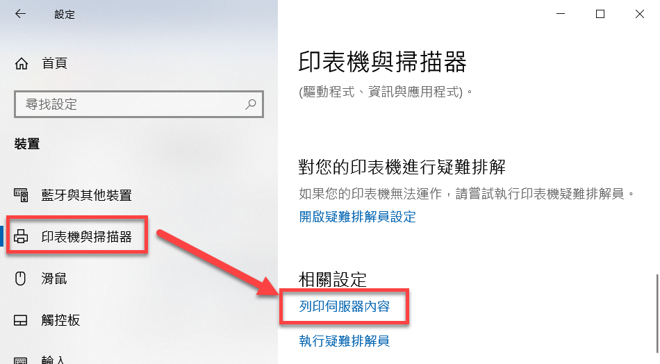

如果是更早期的 Windows 版本，則可參考以下步驟來開啟「列印伺服器內容」：

1. 進入「控制台 > 印表機及傳真」。
2. 在「印表機及傳真」視窗中點擊主選單的「檔案 > 伺服器內容」。

開啟「列印伺服器內容」之後，參考下圖的標示來操作：

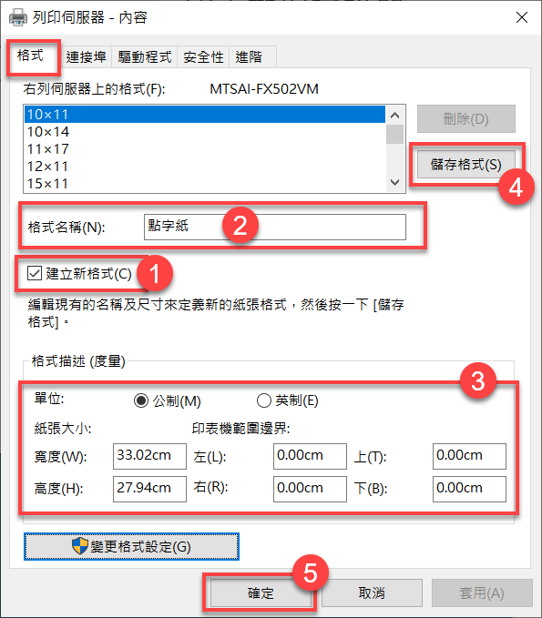

操作說明：

1. 在「格式」頁籤中，勾選「建立新格式」。
2. 在「格式名稱」欄位中輸入「點字紙」（或者你喜歡的其他紙張名稱）。
3. 「單位」選擇「公制」，紙張寬度為 33.02cm，紙張高度為 27.94cm，上下左右的邊界均設為 0。
4. 按「儲存格式」鈕，然後點「確定」即可完成設定。

註：有些印表機即使不做上述設定，也能夠順利列印於點字紙，因為本軟體有自動指定紙張大小的功能。但有些印表機會根據紙張的設定來決定如何進紙，因此必須先建立紙張格式，才能順利列印。

> **注意**
> 如果您要製作雙視文件──亦即同時在紙上印出點字和對應的明眼字，那麼點字就必須列印在明眼字的上方或下方，但由於明眼字和點字是分別由不同的印表機印出來，二者的位置很可能不會剛好對準。因此，將列印環境設定完成後，必須接著進行雙視文件的列印測試，並根據列印出來的結果調整明眼字的列印參數，或印表機的上下邊界、列距等設定。

## 點字文件的製作流程

點字文件或雙視書的製作流程如下圖所示：

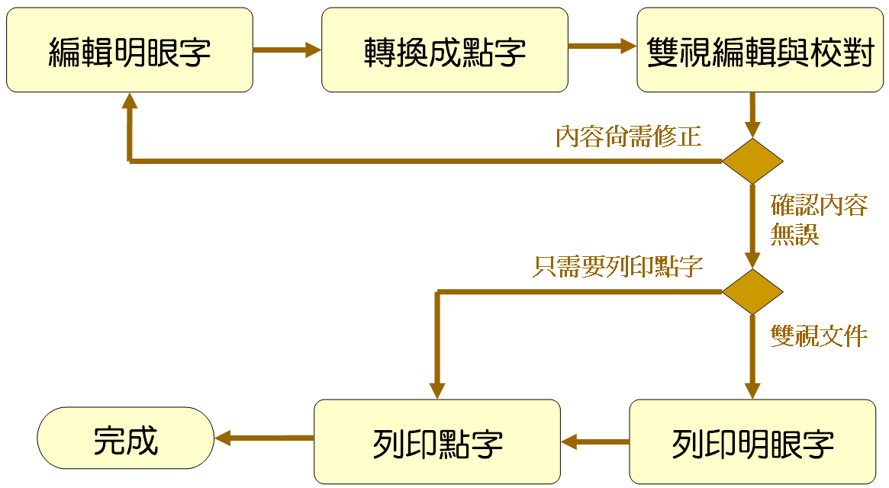

基本上，整個製作流程包含四大步驟：

1. 編輯明眼字
2. 將明眼字轉換成點字
3. 編輯點字（細部校正）
4. 列印點字

上述各個步驟中，步驟 1～2 為前置作業，步驟 3～4 則為後期製作。各步驟的詳細說明如下：

### 步驟 1：編輯明眼字

雖然可以用你習慣的純文字編輯器（例如：記事本，或者 Notepad++）編輯明眼字，然而製作點字書時，會需要用到一些特殊的符號或表示法，例如書名號、原書頁碼等等。此時，您可以使用「易點雙視」內建的編輯器來輸入這些特殊符號。參考下圖：


**注意：**

- 編輯明眼字時，切記不要自行斷行！否則到後面轉成點字時，反而要自行重新調整斷行。因為轉換點字時，系統會根據每列最大方數自動斷字，如果你已經事先斷行，就會造成很多不恰當且不必要的斷行。
- 不建議使用 Word 來編輯明眼字，因為這裡並不需要特殊的字型與編排格式。使用 Word 反而可能增加後續處理的困擾。

由於「易點雙視」的純文字編輯器功能沒有一般的專業編輯器強大（例如：文字搜尋、置換、復原編輯、巨集錄製與播放等），因此你可能會需要在兩個編輯器之間切換，並且經常執行複製、貼上的動作。這樣的交替動作雖然看似麻煩，但其實只要練習幾次，就會知道如何充分利用兩種編輯器，以加速完成明眼字的編輯工作。比如說，先用你熟悉的文字編輯器把主要的內容都輸入完畢，再複製到「易點雙視」中修改。

> **技巧**
> 編輯明眼字時，可以先自行編排需要縮排的部份。例如：縮排一方時，就在開頭輸入一個空格（敲一下空白鍵）。如果有一大段要縮排，可以用 <縮排> 標籤。

**注意：**

- 打勾符號是 "√"。
- 是非題的打圈及打叉符號分別是 "○" 及 "╳"（注意不是 "×"）。

### 步驟 2：轉換成點字

明眼字編輯完成後，只要按工具列的「轉」按鈕或者按 F5 鍵即可進行轉點字的程序（也可以點主選單的「工具 > 轉換成點字」）。參考下圖：


接著，會開啟轉點字的對話窗：

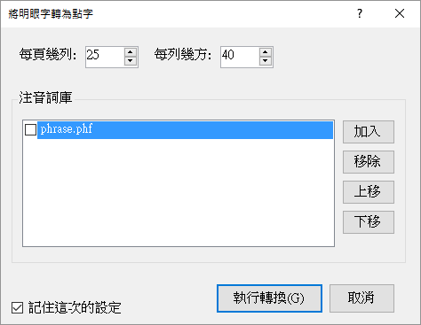

在轉點字的對話窗裡面，您可以設定「每頁幾列」和「每列幾方」。這兩個參數將會影響轉出來的點字要在哪些地方斷行和跳頁。

下次要轉點字時，如果不需要改變這些選項，可以按 `Ctrl+F5` 來直接轉點字，這樣就不會顯示轉點字的對話窗了。（v5.0 開始支援此功能）

#### 自訂詞庫

轉點字時的對話窗裡面有個「注音詞庫」選項，它能夠讓你使用自訂的詞庫來修正某些詞彙的讀音。例如本軟體安裝時便提供了一個 phrase.phf 檔案，裡面的內容如下：

```text
氣得 ㄑㄧˋ ㄉㄜ˙
東西 ㄉㄨㄥ ㄒㄧ˙
什麼 ㄕㄣˊ ㄇㄜ˙
意思 ㄧˋ ㄙ˙
星星 ㄒㄧㄥ ㄒㄧㄥ˙
```

您可以用文字編輯器修改這個檔案，增加新詞與讀音。如此一來，每當轉點字時，便會優先使用您自訂的詞庫（注意在轉點字的對話窗中，必須勾選您想要使用的詞庫）。

#### 無法轉換的字元

如果轉換過程有碰到無法轉換的字元，就會出現提示訊息，告訴你有幾個字元無法轉換，然後顯示一個視窗，在其中列出所有無法轉換的字元，如下圖所示：


圖中右邊的視窗就是所有轉換失敗的字元，其中 `(x, y)` 表示第幾列的第幾個字元。您無須計算字元的位置，只要在那個字上面點一下滑鼠左鍵（例如圖中點到 `(1,4)：c`），編輯視窗的游標就會自動定位到那個字元（如圖中的 `©` 左邊顯示的游標），方便識別。如此一來，您就可以針對每個轉換失敗的字元逐一修正。全部修正完畢之後，再按 F5 來轉換點字。

### 步驟 3：編輯點字

點字轉換工作完成後，會自動開啟雙視編輯器。在此視窗中，您可以再細部修訂明眼字、中文字的注音符號、以及點字，也可以插入新的點字、空方，以及排版，例如：折行、縮排等等。參考下圖：

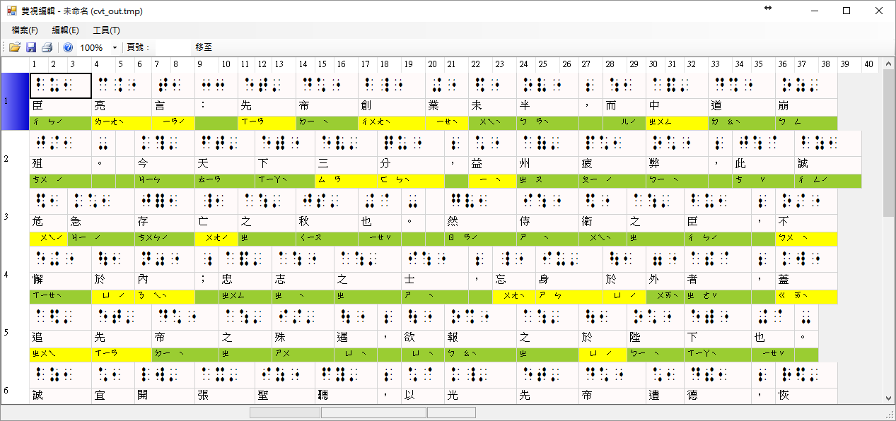

在轉換中文點字時，本系統具備智慧型詞庫辨識功能，能夠正確轉換大多數的常用詞彙，例如：「不要」會轉成「ㄅㄨˊㄧㄠˋ」的點字，而不會轉成「ㄅㄨˋㄧㄠ」。然而，有些詞彙難免因為一字多音的緣故，在轉點字時使用了不正確的讀音。此時您可以在雙視編輯器中修改注音符號（或者將經常出錯的詞彙加入自訂詞庫，參見稍早的「自訂詞庫」一節的說明）。

如果某個中文字是破音字，其注音符號在顯示時就會以黃色背景顯示，而比較常判斷錯誤的破音字，其注音符號就會以紅色背景顯示。至於非破音字，其背景色會是綠色，如下圖所示。

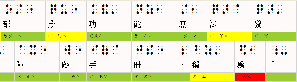

以下摘要整理注音符號背景色代表的意義：

- 綠色：非破音字。
- 黃色：破音字。你可以在中文字或點字方格上點滑鼠右鍵以挑選別的注音符號（甚至修改明眼字和點字）。
- 紅色：比較常判斷錯誤的破音字，提醒你這裡要特別注意。

#### 只轉換部份文字

在編輯明眼字時，你如果想先知道某一些文字轉成點字會是什麼樣子，可以用鍵盤（Shift 加方向鍵）或滑鼠（左鍵拖曳）將這些文字選取起來，然後執行點字轉換功能，如此便可迅速得知轉換結果。你還可以利用此技巧得知一列文字在轉成點字時，將會在哪一個地方斷字（折行），以便進行更細緻的前置作業。由於後續的點字校正編輯工作比較耗費資源，電腦處理的速度較慢，因此如果能在編輯明眼字的前置作業就盡量完成排版工作，自然能縮短點字書的製作時間。

#### 細部校正點字

在雙視編輯視窗裡，將滑鼠移到中文字或點字的儲存格上點一下滑鼠右鍵，便會出現快顯功能表，其中有許多編輯和排版功能，參考下圖：


此功能表中的項目大多一看就知道用途，其中比較不那麼直觀的是「段落重整」。

所謂「段落重整」，指的是由程式自動根據點譯規則來重新整理目前所點選的段落。比如說，在執行段落重整時，程式會檢查是否需要自動折行、或者將下一行的文字自動銜接至前一行的行尾。詳細的說明，請參閱：〈段落重整〉。

> **技巧**
> 由於點字編輯器比較耗費資源，且需要執行較多運算，您會發現在編輯點字時，操作的反應不像編輯明眼字時那麼流暢。因此，在校正點字時，應該先注意段落編排的部份是否大致完成，以及明眼字是否有漏字、錯別字等，若發現這些錯誤，建議放棄這次的點字轉換結果，回到明眼字編輯器中進行修正，等明眼字都修正好了，再執行點字轉換。千萬不要急著修改破音字的注音，以及手動增加額外的點字和空方（縮排），這樣反而會增加製作點字書的時間；那些修正的動作應該是 等到明眼字、必要的空方、和基本的縮排都完成之後才進行。

記住此原則：優先使用明眼字編輯器修正，最後才使用點字編輯器進行細微調整。

## 步驟 4：列印

本節說明如何列印雙面的雙視文件，也就是列印明眼字和點字。

在雙視編輯器視窗中點選「檔案 > 列印」，或直接點工具列上的印表機圖示，即可開啟列印對話窗。製作雙視文件的基本步驟是先列印明眼字，然後再印點字。

### 列印明眼字

列印明眼字時，請先確定「列印」對話窗裡的頁籤是切到「明眼字」。如下圖所示：

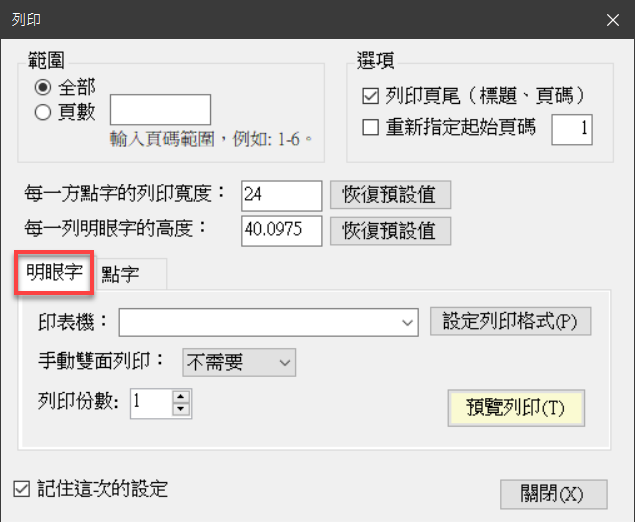

您必須先選擇印表機，然後點「設定列印格式」按鈕，以設定紙張、列印邊界、以及字型大小，參考下圖。

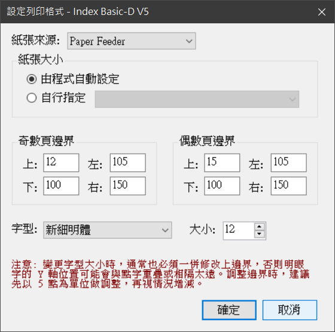

此設定列印格式的動作通常只需做一次（因為如果你在前一個視窗有將左下角的「記住這次的設定」，系統就會連同列印格式的設定一併儲存）。

要特別注意的是奇數頁邊界與偶數頁邊界的設定，主要會跟兩個因素有關：

1. 點字印表機的邊界設定。
2. 明眼字的字體大小設定。

如果你修改了明眼字的字體大小，通常也必須一併調整列印的上邊界，否則列印出來的明眼字可能會與點字重疊或相隔太遠。你必須依你的環境實際測試之後，反覆調整頁邊界至最適當的範圍，這裡的圖例所顯示的，是測試時的設定 ，當時是將偶數頁的上邊界設定成比奇數頁少 2 點，左邊界則比奇數頁少 9 點。圖例中的設定可能不適用於你的環境。

設定列印格式的動作完成後，按「確定」鈕回到上一個視窗，在「雙面列印」下拉清單中選擇「只印奇數頁」，再按「預覽列印」按鈕，即可開啟明眼字的預覽列印視窗。 如果預覽時覺得資料已經不需要再修正，就可以直接點擊預覽視窗的列印鈕，將明眼字內容印出。

奇數頁印完後，接著列印偶數頁。請先將印好的奇數頁文件從印表機中取出，翻面之後重新裝上印表機（假設您的印表機沒有自動雙面列印的功能）。

> ***注意**
> 若採用手動雙面列印的方式，當您印完奇數頁之後，建議您多撕一張報表紙。舉例來說，如果奇數頁一共印了五張報表紙，那麼您就要撕六張報表紙，然後才繼續印偶數頁。如果沒有多撕一張紙，稍後在打印點字時，點字印表機在最後一頁可能會因為沒有足夠的紙張可供捲動送紙，而造成最後一頁的點字無法印出。

接著在「列印」視窗中，「雙面列印」下拉清單中選擇「只印偶數頁」，再按「預覽列印」按鈕，即可將偶數頁的明眼字印出。

### 列印點字

雙面的明眼字印完後，接著將紙張抽出印表機，並裝上點字機（裝紙時，第一頁朝上），然後切到「點字」頁籤，按「列印點字」。參考下圖。

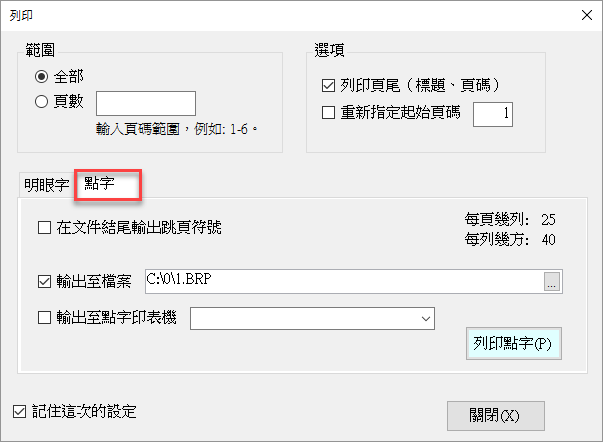

其中的「在文件結尾輸出跳頁符號」通常不需要勾選。如果您發現每次列印點字時，只有最後一頁印不出來，便可以嘗試將此選項打勾。

圖中的「輸出至點字印表機」和「輸出至檔案」選項，若二者皆勾選，則會將您資料分別列印至點字印表機和您指定的檔案。如果您的作業流程是先把所有點字文件都製作完畢再一次印出，可以只勾選「輸出至檔案」，等到所有檔案都輸出完畢，再將這些檔案利用「命令提示字元」視窗，透過 PRINT 或 TYPE 指令直接把整個檔案輸出至點字印表機。一般來說，您也可以利用 Windows 記事本來列印點字檔。

### 微調字寬與列高

稍早在〈列印明眼字〉小節中已經說明如何調整明眼字的字體大小，然而，光是調整字體大小，通常還是無法讓列印出來的內容剛好落在紙張的中間區塊，例如文字可能太接近、甚至超過紙張的右邊界或下邊界。這個時候，您可以在列印對話窗裡面修改以下參數來微調列印的版面：

- **每一方點字的列印寬度**：此參數其實是用來計算明眼字的字距，預設值為 24（點）。請根據您的點字印表機的輸出結果來調整這個參數：如果列印出來的內容太靠近紙張的右邊界，便可以先改為 22，並依照實際列印的結果來微調此參數。
- **每一列明眼字的高度**：此參數代表了每一列文字的高度，預設值為 40.0975（點）。這裡說的「每一列文字的高度」，其實是明眼字、點字、和列距三者的總合，因為每一列點字下方都會有明眼字，然後加上一點間隔。請不用在意那個看起來有點特別的預設值，您只要根據實際列印的結果來微調此參數，讓整體版面不會太貼近或超過紙張的下邊界即可。

以上參數可以在列印對話窗裡面找到，如下圖（紅色框的區域）：

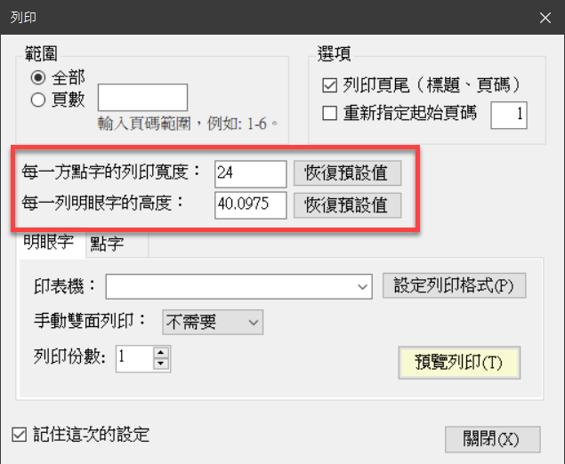

> 如果你的點字印表機型號是 **Index Basic-D V5**，可以參考以下數值來設定：
>
> - 每一方點字的列印寬度 = 23.6
> - 每一列明眼字的高度 = 39.5
> - 字體大小 = 14

### 多人分工合作

如果要點譯的文件內容很多，便可能需要多人分工合作。比如說，使用五台電腦同時進行點字編輯的工作，然後用一台電腦專門用來列印點字，這台電腦的運算能力不用太高，因為只是用來列印點字而已。如此一來，每當點字檔案製作完成，就可以將檔案集中交給單一機器進行列印工作。

以下是列印指令的範例，此範例會將點字檔案 MyData.BRP 輸出至點字印表機（假設點字印表機的連接埠是 LPT1）：

```shell
type MyData.BRP > LPT1
```

> **提醒**
> 點字列印完畢之後，通常會將它裝訂起來，由於點字的凸點很容易因為不小心壓到而破壞，因此通常會在裝訂點字書時，於第一頁和最後一頁加訂保護頁。所謂的保護頁，只是在點字紙的其中一面印滿點字，且有印點字的那一面朝內，用來保護點字書的內容避免因為不小心壓到而破壞。你可以利用點字印表機的測試列印功能來列印保護頁。

## 編輯明眼字的相關功能

### 尋找和取代文字

當游標位在明眼字編輯區裡面時，按 `Ctrl+F` 可啟動搜尋功能。按 `Ctrl+H` 可啟動文字搜尋取代功能。尋找和取代文字的功能都在同一個視窗裡，參考下圖：

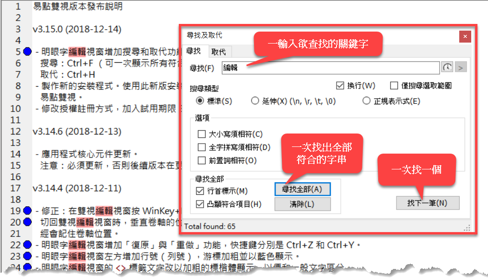

如果忘記快捷鍵，也可至主選單的 **[編輯]** 選單裡面找到尋找和取代文字的功能和快速鍵。

### 將選取的文字加上成對標記

在明眼字編輯視窗中，先選取文字，然後點選「成對的」標籤或符號按鈕（例如私名號、書名號、引號等等），就會以成對的標籤符號將選取的文字包住。

請看示範影片：[https://www.youtube.com/watch?v=3CsqwvDk2EQ](https://www.youtube.com/watch?v=3CsqwvDk2EQ)

### 數學的空括、逗號、分號及句號

示範影片：[https://www.youtube.com/watch?v=JdedDtOr5ro](https://www.youtube.com/watch?v=JdedDtOr5ro)

### 即時點字預覽

EasyBrailleEdit v5.0 新增了即時點字預覽功能，讓您在編輯明眼字時就能即時看到點字轉換結果。詳細說明請參閱：[即時點字預覽](instant-braille-preview.md)

## 雙視編輯的相關功能

### 複製與貼上點字

示範影片：[https://www.youtube.com/watch?v=hfz\-OWbCOSQ](https://www.youtube.com/watch?v=hfz-OWbCOSQ)

### 插入一段文字

示範影片：[https://www.youtube.com/watch?v=z96sx3rZ65I](https://www.youtube.com/watch?v=z96sx3rZ65I) 

### 插入表格

示範影片：[https://www.youtube.com/watch?v=3OQsHlcz\_ZU](https://www.youtube.com/watch?v=3OQsHlcz_ZU)

### 段落重整

所謂「段落重整」，指的是由程式自動根據點譯規則來重新整理目前所點選的段落。比如說，在執行段落重整時，程式會檢查是否需要自動折行、或者將下一行的文字自動銜接至前一行的行尾。

示範影片：[https://www.youtube.com/watch?v=DONX04XaJnM](https://www.youtube.com/watch?v=DONX04XaJnM)

### 頁標題

在雙視編輯視窗中，若從某一行開始換成另一個頁標題，那麼行首便會顯示「標」字，以便識別那一行開始有新的頁標題。另外，在視窗下方的狀態列則會顯示當前的頁標題文字。參考下圖：


此外，在編輯頁標題的時候，視窗下方的狀態列也會顯示目前所選的頁標題，是從雙視文件中的第幾行開始。參考下圖：


## 其他技巧

### 指定經常誤判的破音字

您可以設定經常誤判的破音字，以便應用程式以醒目的顏色來顯示它們，達到提醒的作用。

當您將明眼字轉換成點字，並進入雙視編輯視窗之後，可以看到破音字的注音會以黃色的背景色顯示，而以紅色顯示者則是容易誤判的破音字，例如：「為」、「和」等等。如果您發現有些破音字經常判斷錯誤，但是並未以紅色顯示，您也可以在應用程式的設定檔中加入該字，這樣下次碰到這個字時，EasyBrailleEdit 就會以紅色顯示，以便提醒您這是個經常誤判的破音字，需特別檢查。

**設定方法：**

用 Windows 附屬應用程式中的「記事本」開啟「易點雙視」安裝目錄的 Settings.xml 檔案，找到 "<ErrorProneWords>" 這個標籤，你會看到類似以下的內容：

```xml
<ErrorProneWords>為和</ErrorProneWords>
```

這段設定代表「為」跟「和」這兩個中文字在雙視編輯時，其注音都會以醒目的紅色顯示。您只要將您想要特別提醒的破音字加進去就行了，例如：您想要加入「們」這個字，結果會像這樣：

```xml
<ErrorProneWords>為和們</ErrorProneWords>
```

### 將雙視文件另存成 HTML檔案

示範影片：[https://www.youtube.com/watch?v=PwZWvhzH95Y](https://www.youtube.com/watch?v=PwZWvhzH95Y)

### 雙模式點字轉換設定

從 v5.0 開始，系統支援「內建模式」與「外部工具模式」兩種轉換核心。若您需要切換轉換模式（例如遇到轉換異常時），請參閱：[雙模式點字轉換說明](dual-mode-conversion.md)

### 應用程式組態檔

EasyBrailleEdit 提供了豐富的設定選項，讓您可以根據需求調整程式的行為。完整的組態檔參數說明請參閱：[應用程式組態檔說明](app-config.md)

---

## 聯繫與支援

有關本軟體的最新消息或其他教學文件，可以查看部落格：[http://innoobj.blogspot.com/](http://innoobj.blogspot.com/)

也可以追蹤臉書專頁，以便隨時獲得最新消息：[https://www.facebook.com/easybraille/](https://www.facebook.com/easybraille/)
