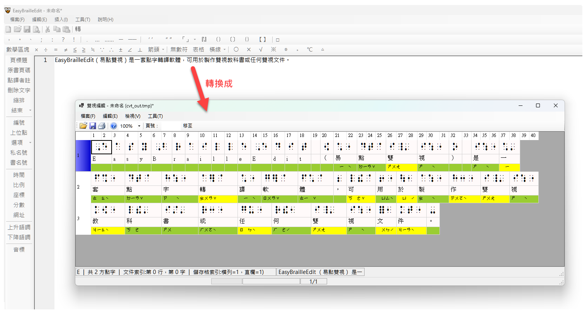

# EasyBrailleEdit

## 簡介

EasyBrailleEdit（易點雙視）是一套點字轉譯軟體，可用於製作雙視教科書或任何雙視文件。

> **In English**
>
> EasyBrailleEdit is a braille transcription software developed by Huan-Lin Tsai to help transcribers provide blind students with braille textbooks.

## 使用方法

作業平台：Windows 10 或 Windows 11

以下是使用此軟體來製作雙視文件的大致流程：

1. **編輯明眼字：** 按平常輸入文字的習慣來編輯書籍內容，其中可以包含中文、英文、數學符號、與其他常用符號。
2. **轉換成點字：** 執行本軟體的點字轉換功能，即可將整篇文字（明眼字）轉換成點字。
3. **雙視編輯：** 轉換成點字之後的文件稱為雙視文件，接著便可透過本軟體的「雙視編輯」功能來進行排版與校稿等編輯工作。
4. **輸出：** 透過本軟體將明眼字與點字分別輸出至一般的印表機和點字印表機（也可以選擇輸出至檔案），完成點字書或雙視書的製作。

## 特色

* 可將一篇編輯好的文件自動轉成點字，並進行雙視編輯。
* 支援英文一級點字。（**TODO:** [支援 Unified English Braille](https://github.com/braillekit/text-to-braille/issues/29)）
* 支援台灣的中文點字與排版規則。
* 支援部分數學點字（小學程度的數學）。
* 支援音標點字。
* 可在雙視編輯視窗中任意插入及刪除點字與明眼字，亦可修改點字。
* 可列印明眼字與點字，方便製作雙視點字書，且支援單面／雙面列印。明眼字可先預覽再列印，並提供各項彈性列印設定，例如：列印邊界、列印頁數範圍、列印的字形大小等，讓印出來的明眼字與對應的點字精準對齊。
* 支援中文破音字判斷，例如：「不要」會自動轉換成「ㄅㄨˊ ㄧㄠˋ」的點字，而不是「ㄅㄨˋ ㄧㄠˋ」。一般文章正確率約可達 70%～90%（視文章內容而定）。使用者亦可自訂詞庫，以修正或增加不足的部份。
* 可標示原書頁碼，並可自動計算與列印點字頁碼。
* 能自動偵測新版本並自動透過網際網路下載。

## 回報問題與建議

如果您在使用本軟體時發現錯誤（bug）或有功能建議，請至本專案的 [Issues](../../issues) 頁面提交您的回報或建議。

## 開發與致謝

本程式由 蔡煥麟 開發。

開發過程中，感謝 [台北市視障者家長協會](https://www.forblind.org.tw/) 提供點字規則資料並協助測試，以及 [聯郃國際視覺輔具中心](https://www.iusee.com.tw/) 提供點字印表機作為開發與測試之用，謹此致謝。

### 開發與設計文件

AI-generated document: [GEMINI.md](Source/EasyBrailleEditApp/GEMINI.md)

## 授權條款

本專案從 2025 年 8 月 開始開放原始碼，授權條款為 [GNU Lesser General Public License v3.0](https://www.gnu.org/licenses/lgpl-3.0.html) ，簡稱 LGPL v3。簡言之：

- 若修改並發佈程式碼 → 必須遵循 LGPL v3，亦即同樣必須開放原始碼，且公開修改內容。
- 若僅是調用或連結原始碼，且沒有將此專案的程式碼和函式庫打包在你的產品內 → 你的產品可以是封閉商業軟體。

