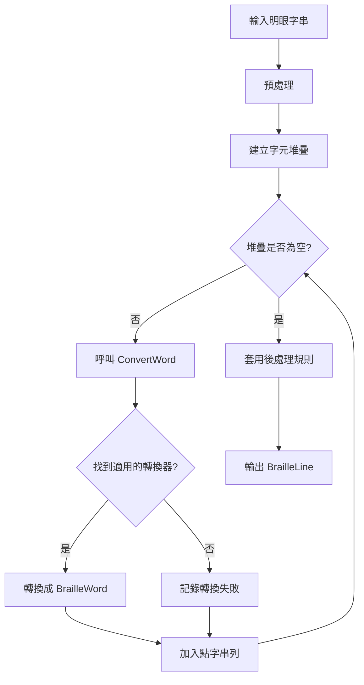

# 點字轉換處理流程

## 概述

點字轉換的核心功能是將明眼字（一般文字）轉換成點字。本文件說明轉換處理的架構設計、核心流程，以及各元件的職責。

轉換過程採用**策略模式（Strategy Pattern）**，透過不同的轉換器（Converter）處理各種類型的文字（中文、英文、數學、表格等），並在轉換後套用一系列點字規則來確保輸出的正確性。

## 架構設計

### 核心元件

#### 1. BrailleProcessor（總指揮/Context）

**位置**: `BrailleToolkit/BrailleProcessor.cs`

- **職責**: 協調整個轉換流程，管理多個轉換器，並套用後處理規則
- **主要方法**: `ConvertLine(string line, int lineNumber)`
- **管理**: 
  - `ContextTagManager` - 追蹤目前的轉換情境（如數學模式、表格模式）
  - 轉換器串列 - 管理所有可用的轉換器
  - 後處理規則 - 套用點字規則

#### 2. IWordConverter（轉換器介面/Strategy Interface）

**位置**: `BrailleToolkit/Converters/IWordConverter.cs`

定義所有轉換器必須實作的標準介面：

```csharp
public interface IWordConverter
{
    List<BrailleWord>? Convert(Stack<char> chars, ContextTagManager context);
}
```

#### 3. 具體轉換器（Concrete Strategies）

位於 `BrailleToolkit/Converters/` 目錄：

| 轉換器 | 職責 | 優先順序 |
|-------|------|---------|
| `ContextTagConverter` | 解析情境標籤（如 `<math>`, `<table>`） | 最高 |
| `TwChineseCharConverter` | 處理中文字、注音及全形標點符號 | 高 |
| `EnglishUebConverter` | 處理英文（UEB - Unified English Braille） | 高 |
| `MathConverter` | 處理數學符號（`<math>` 情境） | 中 |
| `TableConverter` | 處理表格（`<table>` 情境） | 中 |
| `PhoneticConverter` | 處理直接輸入的注音符號 | 低 |
| `UrlConverter` | 處理 URL | 低 |

#### 4. 資料模型

- **`BrailleDocument`**: 代表整個點字文件
- **`BrailleLine`**: 代表一行點字
- **`BrailleWord`**: 代表一個邏輯單位（如一個中文字、一個英文字詞）
- **`BrailleCell`**: 代表一個單獨的六點點字方

## 核心轉換流程

### 主要流程圖



### 詳細步驟

#### 1. 預處理

```csharp
// 移除換行符號
// 替換組態檔中指定的字串
line = ReplaceTextDefinedInAppConfig(line);

// 預先處理特殊標籤的字元替換
line = ReplaceSimpleTagsWithConvertableText(line);
```

#### 2. 建立字元堆疊

將字串反轉後建立堆疊，方便逐一處理：

```csharp
Stack<char> charStack = new Stack<char>(line.Length);
for (int idx = line.Length - 1; idx >= 0; idx--)
{
    charStack.Push(line[idx]);
}
```

#### 3. 核心轉換迴圈

```csharp
while (charStack.Count > 0)
{
    brWordList = ConvertWord(charStack);
    
    if (brWordList != null && brWordList.Count > 0)
    {
        // 成功轉換
        brLine.Words.AddRange(brWordList);
    }
    else
    {
        // 無法轉換的字元
        ch = charStack.Pop();
        OnConvertionFailed(cvtFailedArgs);
    }
}
```

#### 4. ConvertWord 方法

依序嘗試每個轉換器，直到找到可以處理的為止：

1. **ContextTagConverter** - 優先檢查情境標籤
2. **情境專用轉換器** - 如果在特定情境中（數學、表格），呼叫對應轉換器
3. **中文轉換器** - `TwChineseCharConverter`
4. **英文轉換器** - `EnglishUebConverter`
5. **其他轉換器** - 按照優先順序嘗試

第一個成功轉換的轉換器會從堆疊中取出其處理過的字元，並傳回 `BrailleWord` 物件串列。

#### 5. 後處理規則套用

轉換完成後，依序套用以下規則（**順序很重要**）：

```csharp
// 1. 不可斷行規則
GeneralBrailleRule.ApplyDontBreakLineRule(brLine);

// 2. 私名號和書名號規則
ChineseBrailleRule.ApplySpecificNameAndBookNameRules(brLine);

// 3. 中文標點符號規則
ChineseBrailleRule.ApplyPunctuationRules(brLine);

// 4. 修正編號數字為上位點
EnglishBrailleRule.FixNumbers(brLine, brTable);

// 5. 英文大寫規則
EnglishBrailleRule.ApplyCapitalRule(brLine);

// 6. 數字符號規則
GeneralBrailleRule.ApplyDigitRule(brLine);

// 7. 補加必要的空白
GeneralBrailleRule.AddSpaces(brLine);

// 8. 括弧規則
ChineseBrailleRule.EnsureNoDigitSymbolInBrackets(brLine);
```

## 轉換器詳細說明

### TwChineseCharConverter（中文轉換器）

**處理流程**：

1. 使用 `ZhuyinReverseConverter` 取得中文字的注音碼
2. 利用智慧型詞彙分析修正破音字
3. 判斷是否為結合韻、特殊單音（ㄓㄔㄕㄖㄗㄘㄙ）
4. 轉換成台灣點字規則的點字碼

**特殊處理**：

- 結合韻（如 ㄨㄛ）
- 單音字（需加「ㄦ」的點字碼）
- 全形標點符號

### EnglishUebConverter（英文轉換器）

**處理策略**：採用**貪婪演算法（Greedy Algorithm）**

1. 優先匹配最長的縮寫（Contractions）
2. 若無匹配，則退回逐字翻譯（Grade 1）
3. 處理大寫記號（單字大寫、全字大寫）
4. 處理數字符號

### 情境轉換器（Context-Specific Converters）

只有在對應的標籤被啟用時才會作用：

- **MathConverter**: `<math>...</math>` 情境
- **TableConverter**: `<table>...</table>` 情境
- **UrlConverter**: URL 格式的文字

## 詞庫處理

### 破音字處理

利用 Windows IME API（新注音輸入法）的智慧型判斷功能：

```csharp
// 一次取得連續中文字的注音字根
// 例如：「不要」會得到「ㄅㄨˊ ㄧㄠˋ」而非「ㄅㄨˋ ㄧㄠˋ」
phCode = ImmHelper.GetPhoneticCode(chineseText);
```

### 詞庫檔案

- **系統內建詞庫**: `SysPhrase.txt`（嵌入資源）
- **使用者自訂詞庫**: `UserPhrase.txt`（可編輯）

**詞庫格式**：

```text
詞彙 [空格] 注音碼
不要 ㄅㄨˊ ㄧㄠˋ
```

詳細說明請參考 [詞庫檔案設計](../reference/phrases.md)。

## 點字對照表

點字對照表是 XML 檔案，定義字元與點字碼的對應關係。

### 檔案位置

- **中文**: `BrailleTableCht.xml`（或從 `Data/TwChineseBrailleTable.xml` 載入）
- **英文**: `BrailleTableEng.xml`（或從 `Data/EnglishUebBrailleTable.xml` 載入）

### XML 結構

每個 `<symbol>` 元素代表一個點字符號：

```xml
<symbol text="ㄅ" dots="135" type="Phonetic" />
<symbol text="。" dots="256" type="Punctuation" description="句號" />
```

### 屬性說明

| 屬性 | 說明 | 範例 |
|------|------|------|
| `text` | 字元 | `"ㄅ"` |
| `dots` | 點位（1-6） | `"135"` 表示 1、3、5 點 |
| `code` | 十六進位點字碼 | `"15"` |
| `type` | 類型 | `Phonetic`, `Punctuation`, `Tone`, `Misc` |
| `mono` | 是否為特殊單音 | `true`（ㄓㄔㄕㄖㄗㄘㄙ） |
| `joined` | 是否為結合韻 | `true`（如 ㄨㄛ） |

### 點位與點字碼對應

點字方的六個點位對應到一個位元組的位元：

| 點位 | 位元 | 十進位值 | 十六進位值 |
|------|------|----------|-----------|
| 點 1 | Bit 0 | 1 | `0x01` |
| 點 2 | Bit 1 | 2 | `0x02` |
| 點 3 | Bit 2 | 4 | `0x04` |
| 點 4 | Bit 3 | 8 | `0x08` |
| 點 5 | Bit 4 | 16 | `0x10` |
| 點 6 | Bit 5 | 32 | `0x20` |

**範例**: 點位 `"135"` = 0x01 + 0x04 + 0x10 = `0x15`

詳細的對應表請參考 [點字字型對應表](../reference/braille-font-table.md)。

## 錯誤處理

### 轉換失敗事件

當遇到無法轉換的字元時：

```csharp
public event EventHandler<ConversionFailedEventArgs>? ConversionFailed;
```

事件參數包含：

- `LineNumber`: 行號
- `CharIndex`: 字元索引
- `Character`: 無法轉換的字元
- `OriginalLine`: 原始字串

### 無效字元處理

轉換結果會記錄所有無法轉換的字元：

```csharp
public class BrailleConversionResult
{
    public List<CharPosition> InvalidChars { get; set; }
    public string ErrorMessage { get; set; }
}
```

## 程式實作

### 主要檔案

- **BrailleProcessor.cs** - 總指揮與協調者
- **Converters/** - 所有轉換器實作
  - `TwChineseCharConverter.cs`
  - `EnglishUebConverter.cs`
  - `MathConverter.cs`
  - 等等...
- **Rules/** - 點字規則
  - `ChineseBrailleRule.cs`
  - `EnglishBrailleRule.cs`
  - `GeneralBrailleRule.cs`
- **Data/** - 點字對照表 XML 檔案

### 相關文件

- [點字處理流程與架構](../../../../GEMINI.md#點字處理流程與架構) - 完整的架構說明
- [點字規則](../../reference/braille-font-table.md) - 點字對照表詳細資訊
- [詞庫檔案](../reference/phrases.md) - 詞庫設計與使用

## 擴充指南

### 新增轉換器

1. 建立類別實作 `IWordConverter` 介面
2. 在 `BrailleProcessor` 建構函式中註冊轉換器
3. 實作 `Convert` 方法

### 新增點字規則

1. 在適當的規則類別中新增靜態方法
2. 在 `ConvertLine` 方法中適當位置呼叫規則

### 新增點字符號

1. 編輯對應的 XML 點字對照表
2. 如有特殊規則，修改對應的 BrailleRule 類別