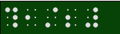

# 分數

表示法:

```xml
<分數>I&N/D</分數>
```

其中 `I` 為整數部分，`N` 為分子，`D` 為分母。整數部份可有可無。

## 範例 1：二分之一

```xml
<分數>1/2</分數>
```



點字輸入方式為：先打 1456 點 → 再打分子（不需加數符） → 再打 34 點 → 再打分母（不需加數符） → 再打 3456 點。

所以：分數最重要的組合是 → 1456 點 + 分子 + 34 點 + 分母 + 3456 點。

## 範例 2：一又二分之一

```xml
<分數>1&1/2</分數>
```


點字輸入方式為：先打帶分數 1 (帶分數需加數符) → 再打 456 點 → 再打 1456 點 → 再打分子（不需加數符） → 再打 34 點 → 再打分母（不需加數符） → 456 點 → 再打 3456 點。

所以：帶分數最重要的組合是 → 帶分數數字 + 456點 + 1456 點 + 分子 + 34點 + 分母 + 456點 + 3456 點。

## 程式處理方式

在 BrailleProcessor.ConvertLine 方法中，判斷目前是否已經進入分數情境，如果是，就呼叫 ConvertFraction 方法，此方法會將 `<分數>……</分數>` 之間的文字取出並轉成分數點字串列。也就是說，在編輯明眼字時，`<分數>……</分數>` 標籤必須位在同一列，而且其中不可包含其他標籤。

ConvertFraction 方法的處理步驟：

1. 分別取出整數部份、分子、以及分母，並且存入不同的字串變數。
2. 將整數部份的字串轉成點字串列。
3. 將分子字串轉成點字串列。注意轉換之後的點字串列，每個點字都要明白指定其 NoDigitCell 屬性為 true，也就是不加數符。
4. 將分母字串轉成點字串列。注意轉換之後的點字串列，每個點字都要明白指定其 NoDigitCell 屬性為 true，也就是不加數符。
5. 補上分子和分母前後的點字符號（456 點、1456 點，以及 456 點、3456 點）。
6. 將整數部份、分子、及分母點字串列結合成一個點字串列並傳回。
