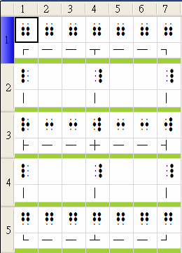

# 表格語法

表示法：

```xml
<表格>
┌──┬──┐
│　　∣　　∣
├──┼──┤
│　　∣　　∣
└──┴──┘
</表格>
```

- `─` 上橫線：2356點
- `─` 下底線：1245點
- `│` 左直線：123點
- `│` 右直線：456點
- `├` 左交叉線：1235點
- `┤` 又交叉線：2456點
- `┼` 中交叉線：2456點

轉出來的結果如下：



注意：

- 雖然沒有四個角的點字，以及 ┬ 和 ┴ 的點字，可是在設計時，明眼字還是要表現出來，比較美觀。
- 上方、中間、和下方的橫線，明眼字都是用 '─' 表現，但對應的點字卻不同，因此要特別處理。
- 左邊的直線和右邊的直線，明眼字採用的符號看起來是同一個，實則為不同字元，因此轉換成點字沒有問題。

## 程式處理方式

增加一個 TableConverter，負責轉換 <表格\> 情境標籤。TableConverter 在進行轉換時，要以一個迴圈來連續處理整列的表格字元，而為了區別上、中、下方橫線的點字，要做特別的判斷：每當碰到 '─' 時，要判斷最近是否有出現過下列字元：

- '┌'：若有，表示這是上方橫線。
- '└'：若有，表示這是下方橫線。
- 其它情況則是中間橫線。
 