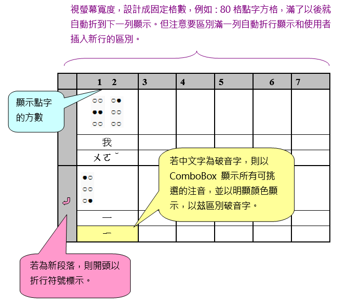

# 以 grid 顯示與編輯明眼字和點字

處理要點：

- 在 grid 中顯示時，是以每個 cell 顯示一個明眼字元為原則。
- 可增、刪、改既有的明眼字和點字。
- 使用者可任意加空白列。
- 可中、英、數字混合編輯。
- 使用者在編輯時，無須注意每列幾方，系統也不需要在內文有變動時即時重新編排。系統只要提供一個「重新排版」功能，當使用者編輯完畢，執行此功能時，就會根據使用者指定的每列方數，在適當的地方斷行。
- 使用者可以單獨修改點字或明眼字。
- 使用者可以明白指定要插入新行。
- 提供「驗證」功能，可檢查違反點字規則的地方，提醒使用者修正。

畫面雛形：

