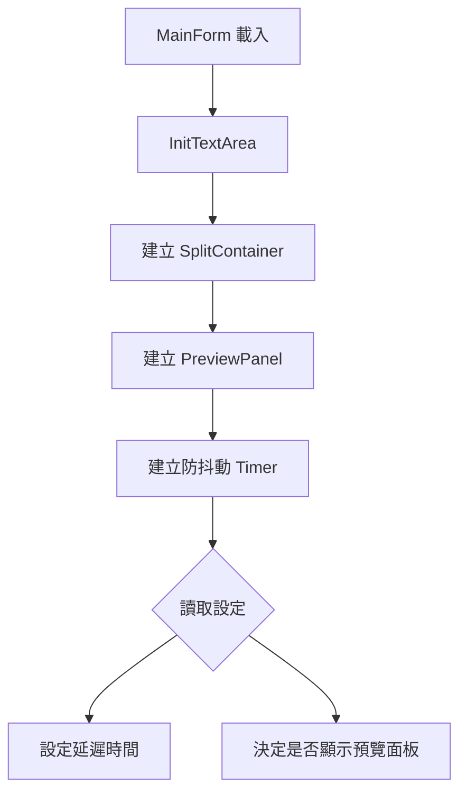
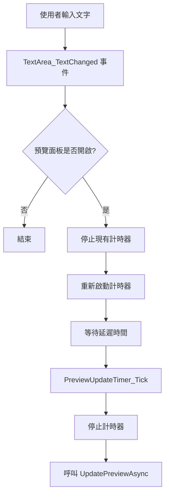
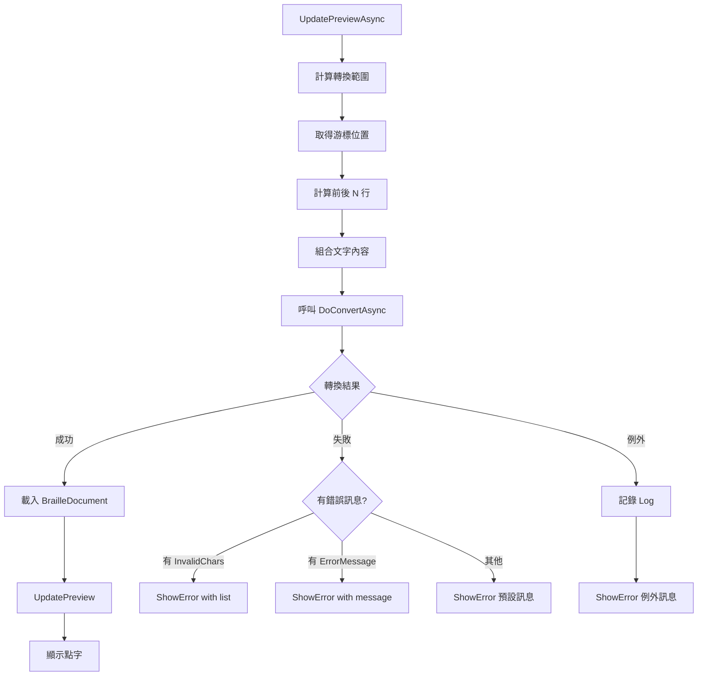

# 即時點字預覽功能設計

## 功能概述

即時點字預覽功能允許使用者在編輯明眼字時，即時看到轉換後的點字結果。此功能採用**防抖動（Debounce）**策略，在使用者暫停輸入一段時間後才更新預覽，避免持續打字時造成效能問題。

### 核心特性

- **自動更新**：使用者停止輸入後，預覽面板自動更新
- **防抖動機制**：預設延遲 1.5 秒後才觸發轉換，避免頻繁更新
- **範圍限制**：僅轉換游標附近的文字（預設前後 3 行），而非全文
- **可配置參數**：延遲時間、上下文行數、是否預設啟用等皆可透過設定檔調整
- **錯誤回饋**：轉換失敗時顯示清晰的錯誤訊息

## 使用者介面

### 預覽面板配置

- 主視窗採用垂直分割（`SplitContainer`）
- 左側：文字編輯區（預設佔 35%）
- 右側：即時預覽面板（預設佔 65%）
- 分隔線可拖曳調整兩側寬度

### 預覽面板顯示內容

#### 正常轉換時

預覽面板以表格形式呈現三列資訊：

1. **原文**：明眼字文字
2. **注音**：中文字的注音符號（若為中文）
3. **點字**：轉換後的點字 Unicode 字元

範例顯示：

```
┌─────────┬─────────┬─────────┐
│ 這      │ 是      │ 測      │
├─────────┼─────────┼─────────┤
│ ㄓㄜˋ   │ ㄕˋ     │ ㄘㄜˋ   │
├─────────┼─────────┼─────────┤
│ ⠌⠡⠐⠂  │ ⠱⠐⠂   │ ⠘⠡⠐⠂  │
└─────────┴─────────┴─────────┘
```

#### 空白內容時

顯示說明訊息：

> 這是顯示即時轉換點字結果的預覽面板。當你在左邊文字編輯區有修改內容，停止敲鍵盤約 1.5 秒之後，這裡就會顯示游標所在位置附近文字的點字轉換結果。
>
> 預覽結果會根據版面設定來自動排版與斷行。自動斷行的依據為每列點字方數（顯示於此視窗的底部狀態列）。
>
> **注意：**不是全文轉換，而僅針對游標所在位置附近的文字進行轉換。

#### 轉換失敗時

當遇到無法轉換的字元或其他錯誤時，預覽面板顯示錯誤訊息：

**錯誤訊息格式：**

```text
⚠️ 即時點字轉換失敗

不支援的字元或符號：

• 字元 ©  (位置：第 3 行，第 5 個字)
• 字元 ®  (位置：第 5 行，第 12 個字)
• 字元 ™  (位置：第 7 行，第 8 個字)

💡 建議：
請移除或替換這些不支援的字元。若您認為這些字元應該被支援，請聯繫開發者。
```

**樣式設計：**

- 背景色：淺黃色（`#fff3cd`），提醒使用者注意
- 邊框：琥珀色（`#ffc107`），增加警示感
- 錯誤標題：紅色粗體
- 字元清單：最多顯示前 10 個無法轉換的字元
- 字元值：灰色背景、紅色粗體、等寬字型
- 建議區塊：淡藍色背景，提供處理建議

## 技術架構

### 核心元件

#### 1. PreviewPanel (預覽面板控制項)

- **位置**：`EasyBrailleEdit/Controls/PreviewPanel.cs`
- **基底類別**：`UserControl`
- **內部控制項**：`WebBrowser`（用於顯示 HTML 內容）

**主要方法：**

```csharp
// 更新預覽內容（正常轉換）
public void UpdatePreview(List<BrailleLine>? lines)

// 顯示錯誤訊息（轉換失敗）
public void ShowError(string errorMessage, List<CharPosition>? invalidChars = null)

// 將點字碼轉換成 Unicode 字元
private string GetBrailleUnicode(byte value)
```

**HTML 渲染：**

- 使用 `StringBuilder` 動態組合 HTML 內容
- 內嵌 CSS 樣式來控制外觀
- 使用 `System.Net.WebUtility.HtmlEncode` 確保特殊字元正確顯示

#### 2. MainForm (主表單)

- **位置**：`EasyBrailleEdit/MainForm.cs`
- **預覽觸發機制**：透過 `Timer` 實作防抖動

**相關變數：**

```csharp
private PreviewPanel m_PreviewPanel;           // 預覽面板實例
private SplitContainer m_SplitContainer;       // 分割容器
private System.Windows.Forms.Timer m_PreviewUpdateTimer;  // 防抖動計時器
```

**主要方法：**

```csharp
// 初始化預覽面板與分割容器
private void InitTextArea()

// 文字變更事件處理（重置計時器）
private void TextArea_TextChanged(object? sender, EventArgs e)

// 計時器到期事件處理（觸發轉換）
private void PreviewUpdateTimer_Tick(object? sender, EventArgs e)

// 執行非同步轉換與更新
private async void UpdatePreviewAsync()

// 執行點字轉換
private async Task<BrailleConversionResult> DoConvertAsync(string content)
```

### 工作流程

#### 1. 初始化階段



**程式碼片段：**

```csharp
m_PreviewUpdateTimer = new System.Windows.Forms.Timer();
int delay = AppGlobals.Config.Braille.AutoPreviewDelay;
if (delay < 1500) delay = 1500;
if (delay > 5000) delay = 5000;
m_PreviewUpdateTimer.Interval = delay;
m_PreviewUpdateTimer.Tick += PreviewUpdateTimer_Tick;
```

#### 2. 更新觸發流程



**防抖動機制說明：**

- 每次文字變更都會重置計時器
- 只有在使用者「停止輸入」達到延遲時間後，才會觸發轉換
- 避免持續輸入時造成過多的轉換請求

#### 3. 轉換與顯示流程



**轉換範圍計算：**

```csharp
int contextLines = AppGlobals.Config.Braille.PreviewContextLines;
int currentLine = m_TextArea.CurrentLine;
int startLine = Math.Max(0, currentLine - contextLines);
int endLine = Math.Min(m_TextArea.Lines.Count - 1, currentLine + contextLines);
```

**錯誤處理邏輯：**

```csharp
if (result.Success && !string.IsNullOrEmpty(result.OutputFilePath))
{
    // 成功：顯示點字
    var doc = BrailleDocument.LoadBrailleFile(result.OutputFilePath);
    m_PreviewPanel.UpdatePreview(doc.Lines);
}
else if (result.HasError)
{
    // 失敗：顯示錯誤訊息
    string errorMsg = result.ErrorMessage;
    if (string.IsNullOrEmpty(errorMsg) && result.InvalidChars.Count > 0)
    {
        errorMsg = "輸入的文字中包含無法轉換的字元。";
    }
    m_PreviewPanel.ShowError(errorMsg, result.InvalidChars);
}
```

### 資料結構

#### BrailleConversionResult

轉換結果的資料結構：

```csharp
public class BrailleConversionResult
{
    public bool Success { get; set; }               // 是否成功
    public string? OutputFilePath { get; set; }     // 輸出檔案路徑
    public bool HasError => !Success || InvalidChars.Count > 0;
    public string ErrorMessage { get; set; }        // 錯誤訊息
    public List<CharPosition> InvalidChars { get; set; }  // 無效字元清單
}
```

#### CharPosition

代表無法轉換的字元及其位置：

```csharp
public struct CharPosition
{
    public char CharValue { get; set; }    // 字元值
    public int LineNumber { get; set; }    // 行號（1-based）
    public int CharIndex { get; set; }     // 字元索引（0-based）
}
```

## 配置參數

所有設定參數位於 `AppConfig.ini` 檔案的 `[Braille]` 區段：

| 參數名稱 | 類型 | 預設值 | 說明 |
|---------|------|--------|------|
| `EnableInstantPreview` | bool | `true` | 是否預設啟用即時預覽面板 |
| `AutoPreviewDelay` | int | `1500` | 防抖動延遲時間（毫秒），範圍：1500-5000 |
| `PreviewContextLines` | int | `3` | 預覽時顯示游標前後的行數 |

**設定檔範例：**

```ini
[Braille]
EnableInstantPreview=True
AutoPreviewDelay=1500
PreviewContextLines=3
```

## 效能考量

### 1. 範圍限制

- **僅轉換游標附近的文字**，而非全文轉換
- 預設轉換游標前後各 3 行（可配置）
- 大幅減少轉換時間，確保即時性

### 2. 防抖動策略

- 使用 `Timer` 實作防抖動
- 連續打字時不會觸發轉換
- 避免頻繁的轉換請求造成效能問題

### 3. 非同步處理

- 使用 `async/await` 進行非同步轉換
- 轉換過程不會封鎖 UI 執行緒
- 確保使用者介面保持流暢

### 4. 暫存檔案

- 轉換結果儲存至暫存檔案
- 避免記憶體中存放大量點字資料
- 由 `BrailleConverterFactory` 建立的轉換器負責管理

## 使用情境

### 情境 1：正常編輯流程

1. 使用者開啟應用程式
2. 預設啟用即時預覽面板（依設定）
3. 使用者開始輸入文字："這是測試"
4. 使用者暫停輸入
5. 1.5 秒後，預覽面板自動更新
6. 顯示轉換後的點字、注音

### 情境 2：遇到無法轉換的字元

1. 使用者輸入："版權符號 © 測試"
2. 使用者暫停輸入
3. 1.5 秒後開始轉換
4. 轉換器遇到 `©` 無法處理
5. 預覽面板顯示錯誤訊息
6. 列出無法轉換的字元及其位置
7. 提供建議：移除或替換該字元

### 情境 3：未儲存的新檔案

1. 使用者點擊「新增」建立新檔案
2. 尚未儲存（標題顯示「未命名」）
3. 使用者輸入文字
4. 預覽功能仍正常運作
5. 即使檔案未儲存，也能即時預覽

### 情境 4：連續輸入

1. 使用者快速連續輸入一個長句子（約 5 秒）
2. 預覽面板**不會**更新（防抖動）
3. 使用者停止輸入
4. 1.5 秒後預覽面板才更新

## 錯誤處理

### 1. 轉換失敗

**原因：**

- 輸入包含無法轉換的字元（如 `©`、`®`、`™` 等特殊符號）
- 輸入格式不符合預期

**處理方式：**

- 呼叫 `PreviewPanel.ShowError` 顯示錯誤
- 列出所有無法轉換的字元（最多 10 個）
- 提供位置資訊（行號、字元索引）
- 給予使用者處理建議

### 2. 例外錯誤

**原因：**

- 轉換器內部錯誤
- 檔案讀寫錯誤
- 記憶體不足等系統問題

**處理方式：**

- 記錄詳細的錯誤 Log（使用 Serilog）
- 向使用者顯示簡化的錯誤訊息
- 不影響主程式繼續運作

**程式碼範例：**

```csharp
catch (Exception ex)
{
    Log.Error(ex, "UpdatePreviewAsync failed");
    m_PreviewPanel.ShowError($"即時預覽發生錯誤：{ex.Message}");
}
```

### 3. 空白內容

**處理方式：**

- 顯示預設的說明訊息
- 不視為錯誤狀況

## 測試驗證

### 1. 功能測試

#### 測試案例 1：啟用預覽

- **步驟**：點擊「啟用即時預覽」按鈕
- **預期結果**：視窗分割成左右兩側，右側顯示預覽面板

#### 測試案例 2：自動更新

- **步驟**：輸入 "Hello World" 後停止
- **預期結果**：1.5 秒後預覽更新

#### 測試案例 3：防抖動

- **步驟**：連續快速輸入 5 秒不停
- **預期結果**：輸入期間預覽不更新，停止後才更新

#### 測試案例 4：未儲存檔案

- **步驟**：新建檔案（未儲存），輸入文字
- **預期結果**：預覽正常運作

#### 測試案例 5：無效字元

- **步驟**：輸入 "測試 © 版權"
- **預期結果**：顯示錯誤訊息，列出 `©` 字元

#### 測試案例 6：空白內容

- **步驟**：清空編輯區
- **預期結果**：顯示說明訊息

### 2. 效能測試

#### 測試案例 1：大量文字

- **步驟**：開啟包含大量文字的檔案（超過 100 行）
- **預期結果**：因為僅轉換游標附近文字，更新速度仍快

#### 測試案例 2：快速切換游標位置

- **步驟**：快速連續點擊不同位置
- **預期結果**：防抖動機制生效，僅最後位置觸發更新

### 3. 配置測試

#### 測試案例：自訂延遲時間

- **步驟**：設定 `AutoPreviewDelay=3000`
- **預期結果**：更新延遲變成 3 秒

## 已知限制

1. **轉換範圍限制**：僅轉換游標附近的文字，無法看到全文轉換結果
   - **原因**：效能考量
   - **替代方案**：使用完整轉換功能

2. **WebBrowser 控制項**：使用舊版 WebBrowser，而非現代的 WebView2
   - **原因**：相容性與簡易性
   - **影響**：部分現代 CSS 功能可能不支援

3. **單一視窗限制**：預覽只能顯示在主視窗右側，無法獨立視窗
   - **原因**：設計簡化
   - **未來改進**：可考慮支援獨立視窗模式

## 相關檔案

### 原始碼

- [PreviewPanel.cs](../../../Source/EasyBrailleEditApp/EasyBrailleEdit/Controls/PreviewPanel.cs) - 預覽面板控制項
- [MainForm.cs](../../../Source/EasyBrailleEditApp/EasyBrailleEdit/MainForm.cs) - 主表單與觸發邏輯
- [BrailleConversionResult.cs](../../../Source/EasyBrailleEditApp/EasyBrailleEdit/Services/BrailleConversionResult.cs) - 轉換結果資料結構
- [BrailleProcessor.cs](../../../Source/EasyBrailleEditApp/BrailleToolkit/BrailleProcessor.cs) - 點字轉換核心

### 技術文件

- [即時預覽轉換流程分析](../../technical/development/instant-preview-conversion-flow.md)
- [雙模式架構設計](../../technical/development/dual-mode-architecture.md)

### 使用者文件

- [即時點字預覽使用說明](../../../docs-user/content/features/instant-braille-preview/)

## 版本歷史

### v5.0 - 初版實作

- 實作即時預覽面板
- 防抖動機制
- 支援未儲存檔案
- 配置參數支援

### v5.1 - 錯誤訊息顯示

- 新增 `ShowError` 方法
- 美化錯誤訊息顯示
- 列出無法轉換的字元清單
- 提供處理建議
