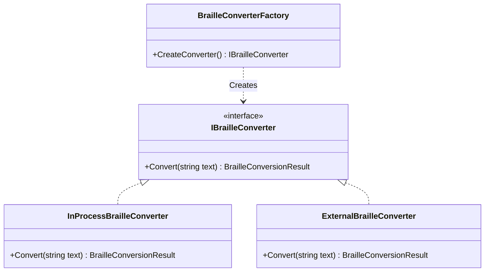

# 雙模式點字轉換架構 (Dual Mode Braille Conversion Architecture)

## 概觀

為了提供更穩定且高效能的點字轉換服務，同時保留舊版外部工具的可靠性，EasyBrailleEdit v5.0 採用了「雙模式點字轉換架構」。此架構允許系統在執行時動態切換使用內建轉換核心 (In-Process) 或外部轉換工具 (External Tool)。

## 架構設計

本架構採用 **策略模式 (Strategy Pattern)** 與 **工廠模式 (Factory Pattern)** 實作。

### 核心介面與類別

1. **`IBrailleConverter` (介面)**
    - 定義點字轉換服務的標準介面。
    - 主要方法：`BrailleConversionResult Convert(string text)`

2. **`InProcessBrailleConverter` (策略 A)**
    - 實作 `IBrailleConverter`。
    - 直接呼叫 `BrailleToolkit` 函式庫進行轉換。
    - **特點**：速度快、記憶體效率高、支援更詳細的錯誤回報。

3. **`ExternalBrailleConverter` (策略 B)**
    - 實作 `IBrailleConverter`。
    - 透過 `Process` 呼叫外部 `Txt2Brl.exe` 執行檔。
    - **特點**：獨立運作、與舊版行為完全一致、作為備援方案。

4. **`BrailleConverterFactory` (工廠)**
    - 負責根據組態設定 (`AppConfig.ini`) 建立適當的 `IBrailleConverter` 實例。
    - 讀取 `UseInProcessConversion` 設定值。

### 類別圖



## 組態設定

轉換模式由 `AppConfig.ini` 中的 `[Braille]` 區段控制：

```ini
[Braille]
UseInProcessConversion=true  ; true=內建模式, false=外部工具模式
```

## 開發與測試

### 建置

專案建置時，會自動執行以下步驟確保兩種模式都能運作：

1. 編譯 `EasyBrailleEditApp.sln`。
2. `EasyBrailleEdit` 專案參考 `BrailleToolkit` (用於內建模式)。
3. PostBuild 事件會將 `Txt2Brl.exe` 及其依賴項複製到輸出目錄 (用於外部工具模式)。

### 測試

單元測試位於 `BrailleToolkit.Tests` 專案中：

- **`InProcessBrailleConverterTests`**：驗證內建轉換邏輯。
- **`ExternalBrailleConverterTests`**：驗證外部工具呼叫邏輯（需確保 `Txt2Brl.exe` 存在）。
- **`BrailleConverterFactoryTests`**：驗證工廠是否根據組態正確建立實例。

執行測試：

```powershell
dotnet test src\EasyBrailleEditApp\BrailleToolkit.Tests
```
