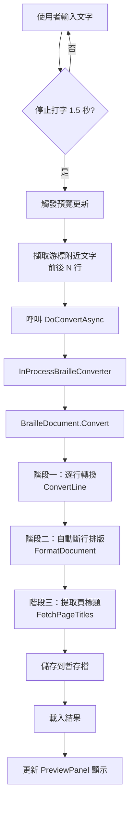

# 即時預覽功能的點字轉換流程分析

> **建立日期**：2025-12-01  
> **作者**：技術文件

## 概述

本文件分析即時預覽功能（Instant Braille Preview）所執行的點字轉換程序，確認其是否包含自動斷行排版功能。

## 結論

**即時自動預覽功能所執行的點字轉換程序「有」包含自動斷行排版。**

即時預覽使用與完整轉換功能相同的轉換邏輯，包括：

1. 明眼字轉點字
2. 套用點字規則
3. **自動斷行排版**（根據 `CellsPerLine` 設定）
4. 頁標題提取

## 完整轉換流程

### 1. 觸發時機

即時預覽在以下情況觸發：

- **延遲觸發**：使用者輸入文字後停止打字約 1.5 秒（可透過 `AutoPreviewDelay` 設定調整）
- **立即觸發**：儲存檔案時

程式碼位置：[MainForm.cs:213-223](file:///d:/Projects/BrailleKit/text-to-braille/Source/EasyBrailleEditApp/EasyBrailleEdit/MainForm.cs#L213-L223)

```csharp
private void TextArea_TextChanged(object? sender, EventArgs e)
{
    Modified = true;

    // Debounce: 每次打字就重置 Timer
    if (!m_SplitContainer.Panel2Collapsed)
    {
        m_PreviewUpdateTimer.Stop();
        m_PreviewUpdateTimer.Start();
    }
}
```

### 2. 文字範圍選取

即時預覽不會轉換全文，而是只轉換游標位置附近的文字：

- 取得游標所在行號
- 擷取前後 N 行（由 `PreviewContextLines` 設定控制，預設為 5 行）
- 將這些行的文字組合成待轉換內容

程式碼位置：[MainForm.cs:394-405](file:///d:/Projects/BrailleKit/text-to-braille/Source/EasyBrailleEditApp/EasyBrailleEdit/MainForm.cs#L394-L405)

```csharp
// 1. 計算範圍 (前後 N 行)
int contextLines = AppGlobals.Config.Braille.PreviewContextLines;
int currentLine = m_TextArea.CurrentLine;
int startLine = Math.Max(0, currentLine - contextLines);
int endLine = Math.Min(m_TextArea.Lines.Count - 1, currentLine + contextLines);

StringBuilder sb = new StringBuilder();
for (int i = startLine; i <= endLine; i++)
{
    sb.Append(m_TextArea.Lines[i].Text);
}
string content = sb.ToString();
```

### 3. 點字轉換過程

#### 3.1 呼叫鏈

```text
MainForm.UpdatePreviewAsync()
  ↓
MainForm.DoConvertAsync()
  ↓
BrailleConverterFactory.CreateConverter()
  ↓
InProcessBrailleConverter.ConvertAsync()
  ↓
BrailleDocument.Convert()
  ↓
BrailleDocument.LoadAndConvert()
```

#### 3.2 轉換服務

程式碼位置：[InProcessBrailleConverter.cs:60-62](file:///d:/Projects/BrailleKit/text-to-braille/Source/EasyBrailleEditApp/EasyBrailleEdit/Services/InProcessBrailleConverter.cs#L60-L62)

```csharp
// 執行轉換
_doc.CellsPerLine = cellsPerLine;
_doc.Convert(content);
```

#### 3.3 文件轉換核心邏輯

程式碼位置：[BrailleDocument.cs:146-175](file:///d:/Projects/BrailleKit/text-to-braille/Source/EasyBrailleEditApp/BrailleToolkit/BrailleDocument.cs#L146-L175)

```csharp
public void LoadAndConvert(TextReader reader)
{
    Log.Debug("BrailleDocument.LoadAndConvert() 開始執行。");

    int lineNumber = 0;
    string? line;

    Clear();

    if (m_Processor == null)
        throw new Exception("在呼叫 BrailleDocument.Load 之前，請先指定 BrailleProcessor。");

    m_Processor.InitializeForConversion();

    // ★ 階段一：逐行轉換（但不斷行）
    while ((line = reader.ReadLine()) != null)
    {
        lineNumber++;
        BrailleLine brLine = m_Processor.ConvertLine(line, lineNumber);
        if (brLine != null && brLine.WordCount > 0)
        {
            AddLine(brLine);
        }
    }

    // ★ 階段二：自動斷行排版（重點！）
    m_Processor.FormatDocument(this);   // 斷行

    // ★ 階段三：提取標題列
    int titleCount = FetchPageTitles();

    Log.Debug($"BrailleDocument.LoadAndConvert() 執行完畢。頁標題數量為 {titleCount}。");
}
```

### 4. 斷行排版實作

#### 4.1 ConvertLine 的設計理念

程式碼位置：[BrailleProcessor.cs:479-486](file:///d:/Projects/BrailleKit/text-to-braille/Source/EasyBrailleEditApp/BrailleToolkit/BrailleProcessor.cs#L479-L486)

```csharp
/// <summary>
/// 把一行明眼字串轉換成點字串列。
/// 此時不考慮一行幾方和斷行的問題，只進行單純的轉換。
/// 斷行由其他函式負責處理，因為有些點字規則必須在斷行時才能處理。
/// </summary>
/// <param name="line">輸入的明眼字串。</param>
/// <param name="lineNumber">字串的行號。此參數只是用來當轉換失敗時，傳給轉換失敗事件處理常式的資訊。</param>
/// <returns>點字串列。若則傳回 null，表示該列不需要轉成點字。</returns>
public BrailleLine ConvertLine(string line, int lineNumber)
```

**關鍵說明**：

- `ConvertLine()` 只負責將明眼字轉成點字
- 不處理斷行問題
- 斷行由獨立的格式化函式處理

#### 4.2 FormatDocument 執行斷行

程式碼位置：[BrailleProcessor.cs:1131-1141](file:///d:/Projects/BrailleKit/text-to-braille/Source/EasyBrailleEditApp/BrailleToolkit/BrailleProcessor.cs#L1131-L1141)

```csharp
public void FormatDocument(BrailleDocument doc)
{
    ContextTagManager context = new ContextTagManager();

    int index = 0;
    while (index < doc.Lines.Count)
    {
        ProcessIndentTags(doc, index, context);
        index += BrailleDocumentFormatter.FormatLine(doc, index, context);
    }
}
```

**功能說明**：

- 處理縮排標籤
- 呼叫 `BrailleDocumentFormatter.FormatLine()` 進行自動斷行
- 根據 `doc.CellsPerLine` 設定決定每行最大方數

### 5. 預覽結果顯示

轉換完成後，結果會傳遞給 `PreviewPanel` 元件顯示：

程式碼位置：[MainForm.cs:415-418](file:///d:/Projects/BrailleKit/text-to-braille/Source/EasyBrailleEditApp/EasyBrailleEdit/MainForm.cs#L415-L418)

```csharp
// 3. 讀取結果
var doc = BrailleDocument.LoadBrailleFile(result.OutputFilePath);

// 4. 更新預覽視窗
m_PreviewPanel.UpdatePreview(doc.Lines);
```

## 轉換流程圖



## 關鍵設定參數

即時預覽功能受以下設定參數控制：

| 參數名稱 | 預設值 | 說明 | 設定檔位置 |
|---------|--------|------|-----------|
| `EnableInstantPreview` | `true` | 是否啟用即時預覽 | `[Braille]` 區段 |
| `AutoPreviewDelay` | `1500` | 延遲觸發時間（毫秒） | `[Braille]` 區段 |
| `PreviewContextLines` | `5` | 游標前後擷取行數 | `[Braille]` 區段 |
| `CellsPerLine` | `32` | 每行最大方數 | `[Braille]` 區段 |

設定檔參考：[BrailleSection.cs](file:///d:/Projects/BrailleKit/text-to-braille/Source/EasyBrailleEditApp/EasyBrailleEdit.Common/Config/Sections/BrailleSection.cs)

## 效能考量

### 為什麼只轉換部分文字？

即時預覽只轉換游標附近的文字（前後各 5 行），而非全文轉換，原因：

1. **效能最佳化**：減少轉換時間，提供即時回饋
2. **焦點明確**：使用者通常只關心正在編輯的區域
3. **避免阻塞 UI**：大文件全文轉換可能造成明顯延遲

### 完整轉換 vs 即時預覽

| 功能 | 轉換範圍 | 是否斷行 | 儲存檔案 | 開啟編輯器 |
|-----|---------|---------|---------|-----------|
| 完整轉換 | 全文 | ✓ | ✓ | ✓ |
| 即時預覽 | 游標附近 N 行 | ✓ | 暫存檔 | ✗ |

## 相關檔案

### 核心檔案

- [MainForm.cs](file:///d:/Projects/BrailleKit/text-to-braille/Source/EasyBrailleEditApp/EasyBrailleEdit/MainForm.cs) - 即時預覽觸發與控制邏輯
- [PreviewPanel.cs](file:///d:/Projects/BrailleKit/text-to-braille/Source/EasyBrailleEditApp/EasyBrailleEdit/Controls/PreviewPanel.cs) - 預覽面板 UI
- [InProcessBrailleConverter.cs](file:///d:/Projects/BrailleKit/text-to-braille/Source/EasyBrailleEditApp/EasyBrailleEdit/Services/InProcessBrailleConverter.cs) - 內建轉換服務
- [BrailleDocument.cs](file:///d:/Projects/BrailleKit/text-to-braille/Source/EasyBrailleEditApp/BrailleToolkit/BrailleDocument.cs) - 點字文件模型與轉換邏輯
- [BrailleProcessor.cs](file:///d:/Projects/BrailleKit/text-to-braille/Source/EasyBrailleEditApp/BrailleToolkit/BrailleProcessor.cs) - 點字處理器（含斷行排版）

### 設定檔案

- [BrailleSection.cs](file:///d:/Projects/BrailleKit/text-to-braille/Source/EasyBrailleEditApp/EasyBrailleEdit.Common/Config/Sections/BrailleSection.cs) - 點字相關設定
- [AppConfig.Default.ini](file:///d:/Projects/BrailleKit/text-to-braille/Source/EasyBrailleEditApp/EasyBrailleEdit.Common/AppConfig.Default.ini) - 預設設定檔

## 總結

即時預覽功能提供完整的點字轉換體驗，包含：

✓ 明眼字轉點字  
✓ 套用所有點字規則  
✓ **自動斷行排版**（根據 `CellsPerLine` 設定）  
✓ 頁標題提取與處理  

唯一的差異在於轉換範圍：即時預覽只處理游標附近的文字，以確保即時回饋的效能需求。轉換邏輯與完整轉換功能完全相同，使用者在預覽窗格中看到的點字結果，就是實際轉換後的樣式（包括斷行排版）。
