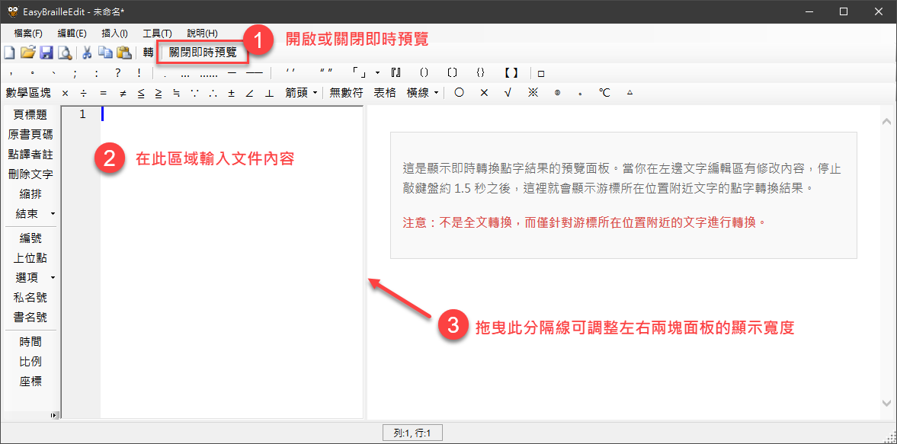

# 即時點字預覽

從 v5.0 開始，新增了「即時點字預覽」功能，讓您在編輯明眼字時，能夠即時看到游標所在位置附近的點字轉換結果，無需頻繁切換到雙視編輯模式。

即時預覽面板會呈現轉換後的點字，並依照紙張版面的設定自動斷行（例如每列最大方數為 40 方，則在第 40 方時自動折行）。

## 功能概要

如下圖：



1. **啟用預覽**：
    - 程式啟動時預設會自動開啟預覽面板。
    - 您也可以點擊工具列上的「啟用即時預覽」按鈕來手動開啟或關閉此功能。

2. **輸入內容**：在左邊內容編輯區域輸入文字。

3. **調整版面**：預覽面板位於視窗右側。您可以拖曳中間的分隔線來調整編輯區與預覽區的寬度比例。

預覽面板會顯示三列資訊：

- **明眼字**：原始文字。
- **注音符號**：中文字的注音（若有）。
- **點字**：對應的點字符號。

注意：

- 即時預覽面板不會將整份文件轉換成點字，而是**僅轉換游標所在位置的前後幾行文字**（預設為前後 3 行），以確保此功能的反應速度，並讓您專注於當前的編輯內容。
- 當您正在打字時，為了避免干擾與效能影響，預覽不會立即更新。當您停止打字約 1.5 秒後，系統會自動執行轉換並更新預覽內容。

## 進階設定

您可以透過修改應用程式安裝目錄下的 `AppConfig.ini` 檔案來調整即時預覽的行為。請找到 `[Braille]` 區段，可用的設定參數如下：

```ini
[Braille]
; 是否預設啟用即時預覽（預設為 true）
EnableInstantPreview=true

; 自動預覽的延遲時間，單位為毫秒（預設為 1500，即 1.5 秒）
AutoPreviewDelay=1500

; 即時預覽的上下文行數，即顯示游標前後幾行的內容（預設為 3）
PreviewContextLines=3
```

### 參數說明

- **EnableInstantPreview**：
  - `true`：程式啟動時自動打開預覽面板。
  - `false`：程式啟動時預設隱藏預覽面板。

- **AutoPreviewDelay**：
  - 設定停止打字後多久觸發轉換。若您的電腦速度較慢，可以將此數值調大（例如 3000）。

- **PreviewContextLines**：
  - 設定預覽範圍。例如設定為 `3`，表示顯示游標所在行，加上前 3 行與後 3 行，共約 7 行的內容。
