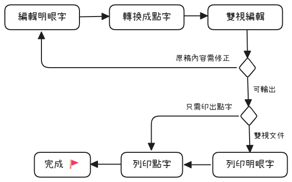

# 快速開始

本文說明如何開始使用「易點雙視」來編輯雙視文件。

## 用法概述

點字文件的製作流程如下圖：

整個製作流程包含四大步驟：

1. **編輯明眼字**：依平常的打字習慣輸入，並利用本軟體提供的特殊控制標籤，便能夠完成一篇同時包含中文、英文、數學等各種文字符號的文件。一邊輸入明眼字時，可在「即時預覽」面板中即時預覽轉換後的點字。
2. **將明眼字轉換成點字**：執行「轉點字」功能，即可將整篇用電腦輸入好的文字（明眼字）轉成點字，接著進入雙視編輯模式。
3. **雙視編輯（細部校正）**：進入雙視編輯模式後，可進一步編輯明眼字與點字，以及編排格式。
4. **列印點字**：把明眼字與點字分別透過一般的印表機以及點字印表機列印出來，一份點字書或雙視書就完成了！

上述各個步驟中，步驟 1～2 為前置作業，步驟 3～4 則為後期製作。各步驟的詳細說明請閱讀以下章節：

- [步驟 1：編輯明眼字](step1-edit-text/)
- [步驟 2：轉換成點字](step2-convert-to-braille/)
- [步驟 3：編輯點字](step3-edit-braille/)
- [步驟 4：列印點字](step4-print-braille/)

