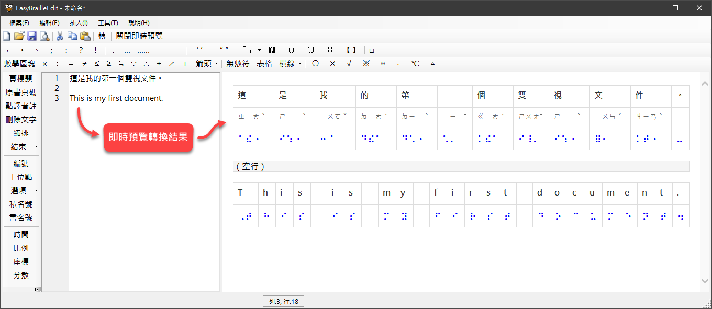
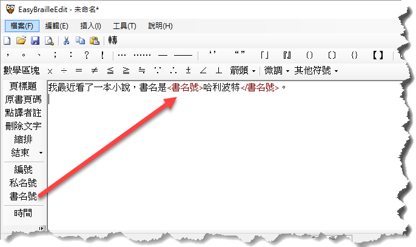

# 步驟 1：編輯明眼字

依平常的打字習慣輸入，並利用本軟體提供的特殊控制標籤，便能夠完成一篇同時包含中文、英文、數學等各種文字符號的文件。

一邊輸入明眼字時，可在「即時預覽」面板中即時預覽轉換後的點字，如下圖：

關於即時預覽功能的詳細說明，請參閱：[即時點字預覽](../../features/instant-braille-preview/)。

**注意：**

- 編輯明眼字時，除非原本就要切分段落，否則並不需要按 Enter 鍵來手動折行（即手動排版）。這是因為易點雙視在執行點字轉換時，能夠自動根據紙張版面的設定來自動斷行。具體來說，程式會根據「每列最大方數」來決定在哪個位置折行。

由於「易點雙視」的純文字編輯器功能比較簡單，因此你可能會想要先使用其他更專業的文字編輯器來編輯明眼字，再複製到「易點雙視」中修改。

> 不建議使用 Word 來編輯明眼字，因為這裡並不需要特殊的字型與編排格式。使用 Word 反而可能增加後續處理的困擾。

## 尋找和取代文字

當游標位在明眼字編輯區裡面時，按 `Ctrl+F` 可啟動搜尋功能。按 `Ctrl+H` 可啟動文字搜尋取代功能。尋找和取代文字的功能都在同一個視窗裡，參考下圖：

如果忘記快捷鍵，也可至主選單的 **[編輯]** 選單裡面找到尋找和取代文字的功能和快速鍵。

## 縮排

編輯明眼字時，可以先自行編排需要縮排的部份。例如：縮排一方時，就在開頭輸入一個空格（敲一下空白鍵）。如果有一大段要縮排，可以用 <縮排> 標籤。

## 特殊符號

製作點字書時，會需要用到一些特殊的符號或表示法，例如書名號、原書頁碼等等。此時，您可以使用「易點雙視」內建的編輯器來輸入這些特殊符號。參考下圖：

### 數學的空括、逗號、分號及句號

示範影片：[https://www.youtube.com/watch?v=JdedDtOr5ro](https://www.youtube.com/watch?v=JdedDtOr5ro)

### 其他符號

- 打勾符號是 "√"。
- 是非題的打圈及打叉符號分別是 "○" 及 "╳"（注意不是 "×"）。

## 將選取的文字加上成對標記

在明眼字編輯視窗中，先選取文字，然後點選「成對的」標籤或符號按鈕（例如私名號、書名號、引號等等），就會以成對的標籤符號將選取的文字包住。

請看示範影片：[https://www.youtube.com/watch?v=3CsqwvDk2EQ](https://www.youtube.com/watch?v=3CsqwvDk2EQ)

## 下一步

完成明眼字編輯後，便可進行下一步：[轉換成點字](../step2-convert/)。
