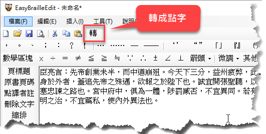
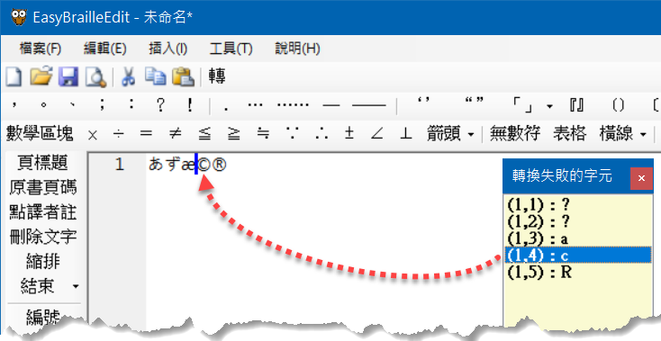

# 步驟 2：轉換成點字

明眼字編輯完成後，只要按工具列的「轉」按鈕或者按 F5 鍵即可進行轉點字的程序（也可以點主選單的「工具 > 轉換成點字」）。參考下圖：



接著，會開啟轉點字的對話窗：


在轉點字的對話窗裡面，您可以設定「每頁幾列」和「每列幾方」。這兩個參數將會影響轉出來的點字要在哪些地方斷行和跳頁。

下次要轉點字時，如果不需要改變這些選項，可以按 `Ctrl+F5` 來直接轉點字，這樣就不會顯示轉點字的對話窗了。（v5.0 開始支援此功能）

### 自訂詞庫

轉點字時的對話窗裡面有個「注音詞庫」選項，它能夠讓你使用自訂的詞庫來修正某些詞彙的讀音。例如本軟體安裝時便提供了一個 phrase.phf 檔案，裡面的內容如下：

```text
氣得 ㄑㄧˋ ㄉㄜ˙
東西 ㄉㄨㄥ ㄒㄧ˙
什麼 ㄕㄣˊ ㄇㄜ˙
意思 ㄧˋ ㄙ˙
星星 ㄒㄧㄥ ㄒㄧㄥ˙
```

您可以用文字編輯器修改這個檔案，增加新詞與讀音。如此一來，每當轉點字時，便會優先使用您自訂的詞庫（注意在轉點字的對話窗中，必須勾選您想要使用的詞庫）。

### 無法轉換的字元

如果轉換過程有碰到無法轉換的字元，就會出現提示訊息，告訴你有幾個字元無法轉換，然後顯示一個視窗，在其中列出所有無法轉換的字元，如下圖所示：



圖中右邊的視窗就是所有轉換失敗的字元，其中 `(x, y)` 表示第幾列的第幾個字元。您無須計算字元的位置，只要在那個字上面點一下滑鼠左鍵（例如圖中點到 `(1,4)：c`），編輯視窗的游標就會自動定位到那個字元（如圖中的 `©` 左邊顯示的游標），方便識別。如此一來，您就可以針對每個轉換失敗的字元逐一修正。全部修正完畢之後，再按 F5 來轉換點字。

## 下一步

完成點字轉換後，會進入「雙視編輯模式」。請參考：[編輯點字](../step3-edit-braille/)。
