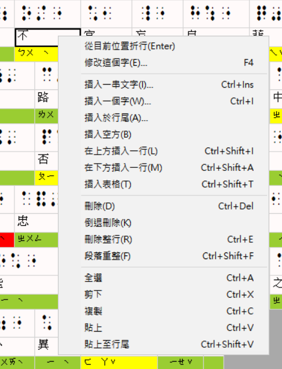
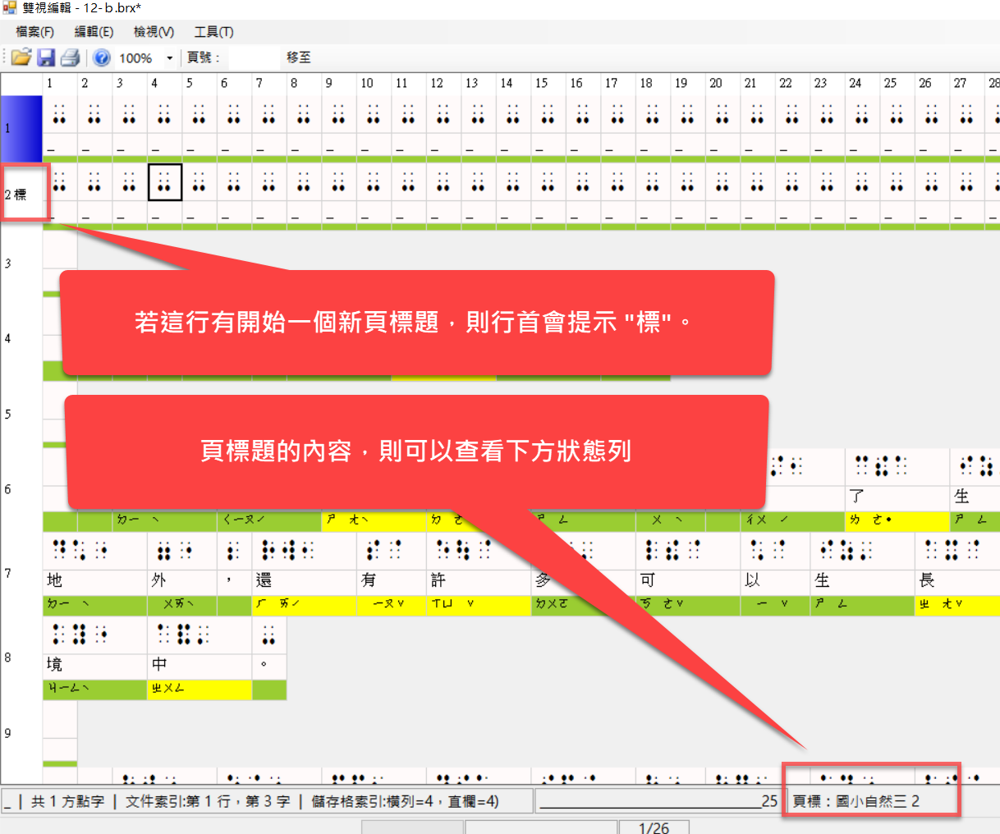
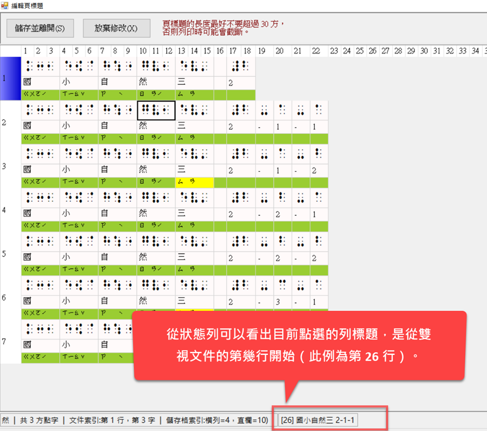

# 步驟 3：編輯點字

點字轉換工作完成後，會自動開啟雙視編輯器。在此視窗中，您可以再細部修訂明眼字、中文字的注音符號、以及點字，也可以插入新的點字、空方，以及排版，例如：折行、縮排等等。參考下圖：


在轉換中文點字時，本系統具備智慧型詞庫辨識功能，能夠正確轉換大多數的常用詞彙，例如：「不要」會轉成「ㄅㄨˊㄧㄠˋ」的點字，而不會轉成「ㄅㄨˋㄧㄠ」。然而，有些詞彙難免因為一字多音的緣故，在轉點字時使用了不正確的讀音。此時您可以在雙視編輯器中修改注音符號（或者將經常出錯的詞彙加入自訂詞庫，參見稍早的「自訂詞庫」一節的說明）。

如果某個中文字是破音字，其注音符號在顯示時就會以黃色背景顯示，而比較常判斷錯誤的破音字，其注音符號就會以紅色背景顯示。至於非破音字，其背景色會是綠色，如下圖所示。


以下摘要整理注音符號背景色代表的意義：

- 綠色：非破音字。
- 黃色：破音字。你可以在中文字或點字方格上點滑鼠右鍵以挑選別的注音符號（甚至修改明眼字和點字）。
- 紅色：比較常判斷錯誤的破音字，提醒你這裡要特別注意。

## 只轉換部份文字

在編輯明眼字時，你如果想先知道某一些文字轉成點字會是什麼樣子，可以用鍵盤（Shift 加方向鍵）或滑鼠（左鍵拖曳）將這些文字選取起來，然後執行點字轉換功能，如此便可迅速得知轉換結果。

你還可以利用此技巧得知一列文字在轉成點字時，將會在哪一個地方斷字（折行），以便進行更細緻的前置作業。由於後續的點字校正編輯工作比較耗費資源，電腦處理的速度較慢，因此如果能在編輯明眼字的前置作業就盡量完成排版工作，自然能縮短點字書的製作時間。

## 細部校正點字

在雙視編輯視窗裡，將滑鼠移到中文字或點字的儲存格上點一下滑鼠右鍵，便會出現快顯功能表，其中有許多編輯和排版功能，參考下圖：



此功能表中的項目大多一看就知道用途，其中比較不那麼直觀的是「段落重整」。

## 段落重整

所謂「段落重整」，指的是由程式自動根據點譯規則來重新整理目前所點選的段落。比如說，在執行段落重整時，程式會檢查是否需要自動折行、或者將下一行的文字自動銜接至前一行的行尾。

示範影片：[https://www.youtube.com/watch?v=DONX04XaJnM](https://www.youtube.com/watch?v=DONX04XaJnM)

> **技巧**
> 
> 由於點字編輯器比較耗費資源，且需要執行較多運算，您可能會發現在編輯點字時，應用程式的反應不像編輯明眼字時那麼流暢。因此，在校正點字時，應該先注意段落編排的部份是否大致完成，以及明眼字是否有漏字、錯別字等，若發現這些錯誤，建議放棄這次的點字轉換結果，回到明眼字編輯器中進行修正，等明眼字都修正好了，再執行點字轉換。不要急著修改破音字的注音，以及手動增加額外的點字和空方（縮排），這樣反而會增加製作點字書的時間；那些修正的動作應該是 等到明眼字、必要的空方、和基本的縮排都完成之後才進行。

**原則：** 優先使用明眼字編輯器修正，最後才使用點字編輯器進行細微調整。

## 複製與貼上點字

示範影片：[https://www.youtube.com/watch?v=hfz\-OWbCOSQ](https://www.youtube.com/watch?v=hfz-OWbCOSQ)

## 插入一段文字

示範影片：[https://www.youtube.com/watch?v=z96sx3rZ65I](https://www.youtube.com/watch?v=z96sx3rZ65I) 

## 插入表格

示範影片：[https://www.youtube.com/watch?v=3OQsHlcz\_ZU](https://www.youtube.com/watch?v=3OQsHlcz_ZU)

## 頁標題

在雙視編輯視窗中，若從某一行開始換成另一個頁標題，那麼行首便會顯示「標」字，以便識別那一行開始有新的頁標題。另外，在視窗下方的狀態列則會顯示當前的頁標題文字。參考下圖：



此外，在編輯頁標題的時候，視窗下方的狀態列也會顯示目前所選的頁標題，是從雙視文件中的第幾行開始。參考下圖：



## 其他技巧

### 指定經常誤判的破音字

您可以設定經常誤判的破音字，以便應用程式以醒目的顏色來顯示它們，達到提醒的作用。

當您將明眼字轉換成點字，並進入雙視編輯視窗之後，可以看到破音字的注音會以黃色的背景色顯示，而以紅色顯示者則是容易誤判的破音字，例如：「為」、「和」等等。如果您發現有些破音字經常判斷錯誤，但是並未以紅色顯示，您也可以在應用程式的設定檔中加入該字，這樣下次碰到這個字時，EasyBrailleEdit 就會以紅色顯示，以便提醒您這是個經常誤判的破音字，需特別檢查。

**設定方法：**

用 Windows 附屬應用程式中的「記事本」開啟「易點雙視」安裝目錄的 Settings.xml 檔案，找到 "<ErrorProneWords>" 這個標籤，你會看到類似以下的內容：

```xml
<ErrorProneWords>為和</ErrorProneWords>
```

這段設定代表「為」跟「和」這兩個中文字在雙視編輯時，其注音都會以醒目的紅色顯示。您只要將您想要特別提醒的破音字加進去就行了，例如：您想要加入「們」這個字，結果會像這樣：

```xml
<ErrorProneWords>為和們</ErrorProneWords>
```

### 將雙視文件另存成 HTML檔案

示範影片：[https://www.youtube.com/watch?v=PwZWvhzH95Y](https://www.youtube.com/watch?v=PwZWvhzH95Y)

## 下一步

完成點字編輯後，如果要輸出至印表機，便可進行下一步：[列印點字](../step4-print/)。