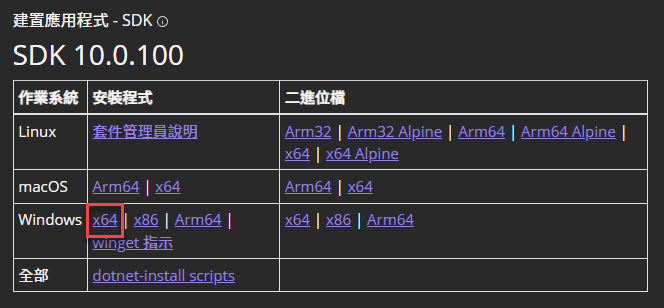

**摘要：** 本文件將說明安裝易點雙視（EasyBrailleEdit）的軟硬體基本需求以及安裝步驟。

適用作業系統：Windows 10、Windows 11。

## 環境需求

### 軟體

- Windows 10、Windows 11

### 硬體

- 個人電腦／筆電：記憶體至少 8GB。
- 顯示器：建議尺寸為 20 吋以上。
- 點矩陣式印表機。只要支援 Windows 作業系統，列印寬度可達 132 行（可列印至少 13 英吋寬的紙張）的印表機均可。最好是可以列印三聯以上的複寫紙（這是因為點字紙比較厚，有些點矩陣印表機在捲動時會因為紙張太厚而卡紙，若印表機支援列印三聯以上的複寫紙，通常就不會有這個問題）。參考廠牌型號：Epson LQ-2180（LQ-2180C）。
- 點字印表機。目前已實測過的點字印表機如下：
  - Enabling Technologis 公司的雙面點字印表機，型號為 ET 或 Juliet Classic/Juliet Pro。
  - Impacto Texto

如果不確定您的點字印表機是否相容，可以先[提出問題](../contact)。

## 安裝步驟

### 步驟 1：安裝 .NET 10

用瀏覽器開啟以下連結：

<https://dotnet.microsoft.com/zh-tw/download/dotnet/10.0>

網頁開啟後，應該能看到多個不同作業平台的 .NET SDK 10.x 的下載連結。目前大多電腦都是 x64 架構，故選擇 Windows x64 的下載連結。如下圖：

> 如果您的電腦是 32 位元的 x86 架構，則點擊 x86 的下載連結。

### 步驟 2：安裝 EasyBrailleEdit

點擊以下連結來下載易點雙視的安裝程式，然後執行安裝程式。

<https://github.com/braillekit/text-to-braille/releases/download/5.0.0/v5.0.0-setup.exe>

預設安裝目錄： `C:\EasyBrailleEdit5`

安裝完成後，應可在 Windows 桌面找到易點雙視的捷徑圖示。雙擊捷徑圖示即可啟動易點雙視。

## 下一步

請閱讀 [快速開始](../get-started/) 來學習如何使用「易點雙視」。
